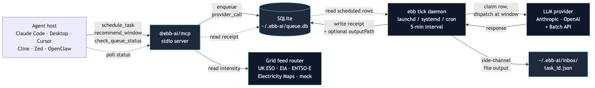
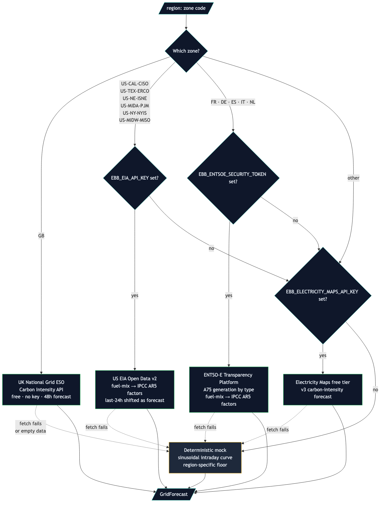

# ebb-ai

**Workload scheduling for the agentic-AI economy.**
*Defer non-urgent LLM tasks to cheap, low-load grid windows. ~50%
cheaper inference via Batch APIs, smoother data-center load curves,
auditable carbon receipts. MCP-native, ships as an `npm` package and
a one-command Claude Code plugin.*

[](./LICENSE)
[](https://www.npmjs.com/package/@ebb-ai/core)
[](https://www.npmjs.com/package/@ebb-ai/mcp)
[](https://www.npmjs.com/package/@ebb-ai/cli)
[](#tests)
[](https://www.ebb-ai.com/docs)
[](https://www.ebb-ai.com/docs#install)
[](https://www.ebb-ai.com)

## Why defer non-urgent AI work?

US AI compute is projected to consume 6.7–12% of national electricity
grid load by 2028 ([DOE 2024](https://www.energy.gov/eere/buildings/articles/2024-united-states-data-center-energy-usage-report)).
Most agent workload that lands on that load is *deferrable* (overnight
summaries, batch analyses, scheduled compliance scans, multi-step
report generation) — agent code just dispatches it synchronously by
default. `ebb-ai` makes the choice automatic. Four parallel wins:

1. **Lighter on the grid.** Spreads load away from peak hours, which is
   what ISOs and grid operators want from large compute users.
2. **50% cheaper.** Auto-routes through Anthropic and OpenAI Batch APIs
   (24-hour SLA) when the deadline allows. Same prompt, half the bill.
3. **Faster at off-peak.** Anthropic explicitly expanded off-peak
   capacity in 2026 ([rate-limit policy](https://docs.claude.com/en/api/rate-limits))
   — doubled usage limits outside peak hours, citing smoothed demand.
   Sync calls observe shorter queues.
4. **40–70% lower carbon.** Per-task carbon receipts against the actual
   grid intensity used at dispatch, persisted to a local SQLite ledger.
   Auditable, region-aware, reproducible.

`ebb-ai` is the same code that would have fired a sync LLM call —
now deferred to the cleanest, cheapest, fastest hour inside the
deadline. Apache-2.0.

```typescript
import { recommendWindow } from "@ebb-ai/core";

const plan = await recommendWindow({
  deadline: "2026-05-14T08:00:00-04:00",
  region: "US-CAL-CISO",
});

// {
//   scheduledFor:                "2026-05-14T05:00:00.000Z",
//   intensityGCo2PerKwh:         60,
//   band:                        "very_clean",
//   estimatedCarbonGCo2:         0.1,
//   estimatedSavingsVsNowPct:    73,
//   batchEligible:               true,
//   reasoning:
//     "cleanest in-deadline window is 05:00 UTC (very clean mix); " +
//     "~73% cleaner than dispatching now; Batch API saves an " +
//     "additional 50% on cost (24h SLA)"
// }
```

Same call surfaces as an **MCP tool** to any compatible agent host
(Claude Desktop, Claude Code, Cursor, Cline, Continue, Zed,
Windsurf, OpenClaw, OpenAI Codex CLI, Pi). The agent asks
`recommend_window`, sees the plan, then commits via `schedule_task`
— or doesn't.

> **Status:** v0.7 · 2026-05-14 · `@ebb-ai/{core,mcp,cli}` published
> to npm under the `@ebb-ai` org. **One-command Claude Code plugin**
> via `claude plugin install ebb-ai`. **Four real-data grid feeds**:
> UK National Grid ESO Carbon Intensity API (GB, free no key),
> US EIA Open Data (CAISO / ERCOT / ISO-NE / PJM, free with key),
> ENTSO-E Transparency Platform (FR / DE, free with token), and
> Electricity Maps as universal fallback. Anthropic + OpenAI Batch
> adapters, durable SQLite queue, Python port at parity, live
> dashboard, `recommend_window` planning endpoint, always-on `ebb
> tick` CLI with macOS launchd + Linux systemd + pmset/rtcwake wake
> events, full control surface (`cancel_task` / `expedite_task` /
> `update_deadline` / `retry_task`), receipt redaction, file output,
> retry-with-backoff. **88 + Python tests passing across 4 packages
> and 2 languages.** See [QUICKSTART.md](./QUICKSTART.md).

### Live demo

[](https://vercel.com/new/clone?repository-url=https%3A%2F%2Fgithub.com%2FVitalini%2Febb-ai&root-directory=apps%2Fdashboard&project-name=ebb-ai-dashboard&repository-name=ebb-ai-dashboard)

Or visit the maintainer-hosted dashboard at
**[ebb-ai.com](https://ebb-ai.com)** to see live grid-load and
carbon-intensity forecasts across the seven regions where the major
LLM providers run inference (CAISO, ERCOT, ISO-NE, PJM, Great Britain,
France, Germany) and to try the best-window planner without installing
anything. Great Britain is powered by the free
[National Grid ESO Carbon Intensity API](https://carbonintensity.org.uk/)
(real data, no key required); the other zones use Electricity Maps when
a key is configured and a deterministic mock otherwise.

---

## Why

AI inference is becoming a major load on US grid infrastructure.
Data-center electricity demand has doubled since 2020 and is projected
to keep rising as agentic workloads scale.
But the same agent code that triggers this load dispatches it
synchronously by default — even when the task is "summarize my inbox
overnight" or "rewrite these 5,000 product descriptions by Friday."
Three things follow:

- **Cost.** Anthropic and OpenAI both offer Batch APIs at a flat **50%
  discount** for tasks that can wait up to 24 hours. Almost no agent
  code uses them, because the choice has to be made at the call site.
  `ebb-ai` makes the choice automatic — and routes deadline-tolerant
  work through the cheaper path.
- **Grid load.** Data-center AI compute is concentrated in a few
  US regions (PJM Mid-Atlantic / Virginia, ERCOT Texas, CAISO
  California). Peak-hour AI workloads compete with hospitals,
  industrial users, and residential customers for capacity that is
  already constrained — Virginia regulators have flagged data-center
  load growth as a top-tier reliability concern. Time-shifting
  deferrable workloads to off-peak windows reduces the peak the grid
  has to plan for.
- **Carbon, as a measurable side effect.** Grid carbon intensity
  varies 30–60% inside a single day. The same dispatch decision that
  saves cost and smooths load also emits less CO₂. `ebb-ai` writes an
  auditable receipt for every dispatch — useful for ESG reporting,
  cost-accounting, and upcoming compute-disclosure regulations.

`ebb-ai` automates the choice for any task that is not "answer me
right now."

---

## Components

| Package | Purpose |
|---|---|
| `@ebb-ai/core` | TypeScript core library (v0.2). `defer()` API, `AnthropicAdapter`, `OpenAIAdapter`, opt-in SQLite-backed durable queue. |
| `@ebb-ai/mcp` | Model Context Protocol server (v0.2). Drop-in for Claude Desktop, Claude Code, OpenClaw, Cursor. |
| `ebb-ai` (Python) | Python 3.11+ port. `asyncio` scheduler, `aiosqlite` persistence, Anthropic + OpenAI adapters. |
| `apps/web` | Next.js 15 website at https://www.ebb-ai.com — install picker (13 hosts), live carbon-intensity map, best-window planner, docs. |
| `packages/claude-code-plugin` | Claude Code plugin tree (8 `/ebb-ai:*` slash commands + auto-invocation skill + MCP wiring). |
| `packages/openclaw-plugin` | OpenClaw plugin (`@vitalini/ebb-ai` on ClawHub). Native OpenClaw tools mirroring the MCP surface. |
| `docs/spec` | Upstream MCP spec proposal for `priority`, `deadline`, `carbon_budget` fields. |

---

## Architecture



The MCP server is a thin stdio process the agent host (Claude Code,
Claude Desktop, Cursor, Cline, Zed, OpenClaw) spawns. It enqueues
work to a SQLite-backed queue at `~/.ebb-ai/queue.db`; an off-process
`ebb tick` daemon (launchd / systemd / cron) reads scheduled rows
and dispatches them to the LLM provider at the chosen window. The
grid feed is a side-channel — the router picks per-zone between four
real-data sources before falling back to mock.



## Quick start

**See [QUICKSTART.md](./QUICKSTART.md) — four steps, five minutes.**

### As a Claude Code plugin (one-command install)

```bash
claude plugin marketplace add Vitalini/ebb-ai
claude plugin install ebb-ai
```

That ships three slash commands (`/ebb-ai:defer`, `/ebb-ai:check`,
`/ebb-ai:grid`), a `carbon-aware-coding` skill, and auto-wires the
`@ebb-ai/mcp` MCP server. Full plugin reference: **[`PLUGIN.md`](./PLUGIN.md)**.

```
> /ebb-ai:defer "Summarize today's GitHub notifications" --by 4h
Deferred ✓ 38% cleaner than now, scheduled for 22:15 UTC, est. 0.34 g CO2e

> /ebb-ai:check
2 tasks queued · oldest in 1h · cleanest at 03:00 UTC
```

Full command surface: `/ebb-ai:{defer, plan, check, cancel, expedite,
reschedule, retry, grid}`. Tasks persist to `~/.ebb-ai/queue.db` and
survive Claude Code restarts.

### As an MCP server (Claude Desktop / Cursor / Cline / Zed)

```bash
npm install -g @ebb-ai/mcp     # or run via npx -y @ebb-ai/mcp
```

Then add to Claude Desktop's MCP config
(`~/Library/Application Support/Claude/claude_desktop_config.json` on
macOS):

```json
{
  "mcpServers": {
    "ebb-ai": {
      "command": "npx",
      "args": ["-y", "@ebb-ai/mcp"],
      "env": {
        "EBB_ELECTRICITY_MAPS_API_KEY": "optional; falls back to mock data without it. GB is always live via the free UK Carbon Intensity API."
      }
    }
  }
}
```

The MCP server exposes three tools to the agent:

- `get_grid_forecast(region, hours?)` — returns the next N hours of
  carbon intensity for a grid region (e.g. `US-CAL-CISO`).
- `schedule_task(prompt, deadline, model?, carbon_budget_g?)` — queues a
  task for execution at the cleanest window inside the deadline.
- `check_queue_status(task_id?)` — lists pending tasks and any
  completed receipts.

### As a library

```typescript
import { defer } from "@ebb-ai/core";

const result = await defer(
  () => anthropic.messages.create({ /* … */ }),
  {
    deadline: "2026-05-13T08:00:00-04:00",
    carbonBudgetG: 5,
    region: "US-CAL-CISO",
  },
);
```

### With a provider adapter and the Batch API (v0.2)

```typescript
import { Scheduler, AnthropicAdapter } from "@ebb-ai/core";

const scheduler = new Scheduler({ dbPath: "/var/lib/ebb/queue.sqlite" });
const adapter = new AnthropicAdapter();

await scheduler.defer(
  () => adapter.dispatch("claude-sonnet-4-5", "Summarize today's git commits."),
  { deadline: "2026-05-13T08:00:00-04:00", region: "US-CAL-CISO" },
);

// or — submit 100 prompts via Anthropic Message Batches for a 50% discount:
const handle = await adapter.dispatchBatch("claude-sonnet-4-5", prompts);
console.log(handle.batchId);
```

The SQLite-backed queue is opt-in via `dbPath`; without it the
scheduler runs in-memory as in v0.1. The Anthropic and OpenAI SDKs are
peer dependencies — install them only if you use the corresponding
adapter.

### Python

```bash
pip install -e "packages/core-py[anthropic,openai]"
```

```python
import asyncio
from ebb_ai import defer

asyncio.run(defer(
    lambda: do_work(),
    deadline="2026-05-13T08:00:00-04:00",
    carbon_budget_g=5,
    region="US-CAL-CISO",
))
```

### Dashboard

```bash
pnpm --filter @ebb-ai/web dev
# → http://localhost:3000
```

Pages: live carbon-intensity map (7 regions: CAISO, ERCOT, ISO-NE, PJM,
GB, FR, DE), 72-hour forecast charts, best-window planner, queue viewer.

**Grid data sources** (per zone, falls back to mock on failure):

| Zone | Source | Auth | Notes |
|---|---|---|---|
| `GB` | [UK National Grid ESO Carbon Intensity API](https://carbonintensity.org.uk/) | None | Real 48h forecast, always on |
| `US-CAL-CISO`, `US-TEX-ERCO`, `US-NE-ISNE`, `US-MIDA-PJM` | [US EIA Open Data](https://www.eia.gov/opendata/) | Free API key (`EBB_EIA_API_KEY`) | Hourly fuel-mix → carbon intensity via IPCC AR5 factors |
| `FR`, `DE` (plus `ES`, `IT`, `NL` opt-in) | [ENTSO-E Transparency Platform](https://transparency.entsoe.eu/) | Free token (`EBB_ENTSOE_SECURITY_TOKEN`) | Realised generation by type → carbon intensity |
| any zone (universal fallback) | [Electricity Maps](https://www.electricitymaps.com/) free-tier | `EBB_ELECTRICITY_MAPS_API_KEY` | Used when zone-specific source missing |
| anything else | Deterministic mock curve | None | Used when no key set or upstream fails |

WattTime marginal-emissions support is on the v0.8 roadmap. Want to add
another free public source? Each adapter is a single function in
`packages/core-ts/src/grid.ts` (~80 lines) — open a PR.

---

## Install (development)

```bash
# from the repo root
pnpm install        # installs all workspace packages
pnpm build          # builds @ebb-ai/core and @ebb-ai/mcp
pnpm test           # runs vitest across packages
```

Requirements: Node 20+, pnpm 9+. Python 3.11+ if working on the Python
package.

---

## Documentation

- [`ROADMAP.md`](./ROADMAP.md) — 24-week execution plan, architecture,
  roadmap, success metrics.
- [`docs/`](./docs/) — design docs, MCP spec proposals (forthcoming).
- [`examples/`](./examples/) — OpenClaw demo skill, Claude Code config.

---

## License

[Apache License 2.0](./LICENSE) — patent grant included.

---

## Contributing

This project is in active early development. Issues and PRs welcome;
see the `ROADMAP.md` roadmap for current scope. Major new features should
be discussed in an issue first to avoid duplicate effort.

---

*Built by [Vitalii Borovyk](https://github.com/Vitalini).*
