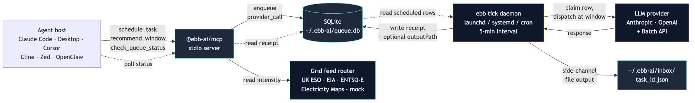
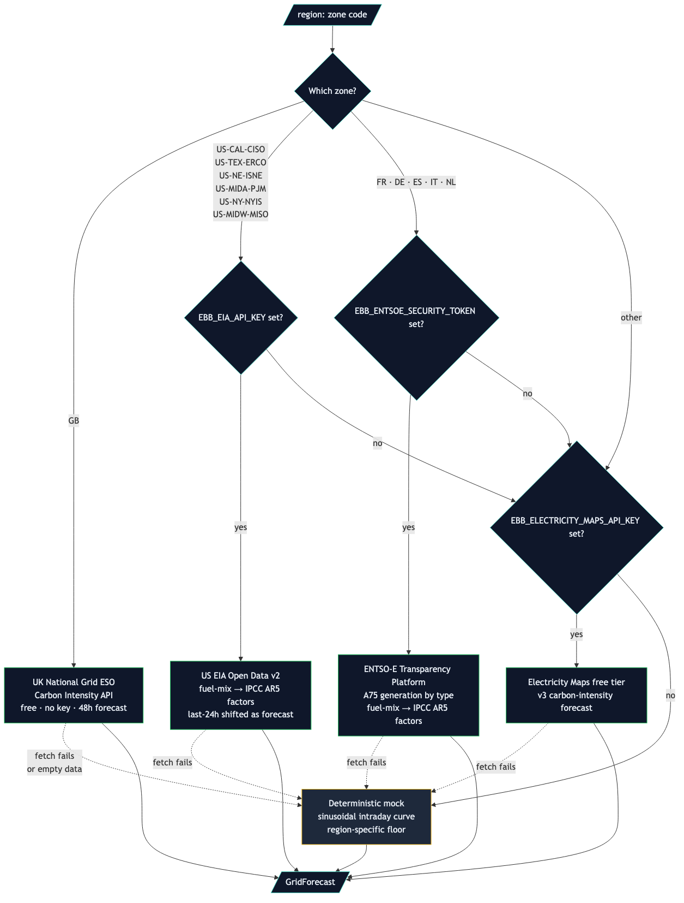

# ebb-ai

**Workload scheduling for the agentic-AI economy.**
*Defer non-urgent LLM tasks to cheap, low-load grid windows. ~50%
cheaper inference via Batch APIs (projected, provider list price),
smoother data-center load curves, auditable carbon receipts.
MCP-native, ships as an `npm` package and a one-command Claude Code
plugin.*

[](./LICENSE)
[](https://www.npmjs.com/package/@ebb-ai/core)
[](https://www.npmjs.com/package/@ebb-ai/mcp)
[](https://www.npmjs.com/package/@ebb-ai/cli)
[](#tests)
[](https://www.ebb-ai.com/docs)
[](https://www.ebb-ai.com/docs#install)
[](https://www.ebb-ai.com)

## Why defer non-urgent AI work?

US data centers are projected to consume 6.7–12% of national electricity
grid load by 2028 ([DOE 2024](https://www.energy.gov/eere/buildings/articles/2024-united-states-data-center-energy-usage-report)), driven primarily by AI compute.
Most agent workload that lands on that load is *deferrable* (overnight
summaries, batch analyses, scheduled compliance scans, multi-step
report generation) — agent code just dispatches it synchronously by
default. `ebb-ai` makes the choice automatic. Four parallel wins:

1. **Lighter on the grid.** Spreads load away from peak hours, which is
   what ISOs and grid operators want from large compute users.
2. **50% cheaper (projected, Batch API list price).** Auto-routes
   through Anthropic and OpenAI Batch APIs (24-hour SLA) when the
   deadline allows. Same prompt, half the bill.
3. **Faster at off-peak.** Anthropic explicitly expanded off-peak
   capacity in 2026 ([rate-limit policy](https://docs.claude.com/en/api/rate-limits))
   — doubled usage limits outside peak hours, citing smoothed demand.
   Sync calls observe shorter queues.
4. **Lower carbon.** Dispatch lands in the cleanest grid hour inside
   the deadline; the saving depends on region and day (see
   [docs/claims.md](docs/claims.md)). Per-task carbon receipts against the actual
   grid intensity used at dispatch, persisted to a local SQLite ledger.
   Auditable, region-aware, reproducible. v0.10+ uses per-model Wh/token
   coefficients (Patterson 2021, Luccioni 2024, Hugging Face AI Energy
   Score) so receipts reflect what the agent actually ran — not a flat
   placeholder. v0.11+ signs every receipt with Ed25519 so consumers can
   verify them offline via `ebb verify` (B2B ESG export path).

`ebb-ai` is the same code that would have fired a sync LLM call —
now deferred to the cleanest, cheapest, fastest hour inside the
deadline. Apache-2.0.

A real run, excerpted (GB, 2026-09-30T21:03:30Z, live National Grid ESO
feed, local Ollama `llama3.2:1b`; raw output and reproducer in
[`docs/examples/2026-09-30-GB-tick/`](docs/examples/2026-09-30-GB-tick/)):

```console
$ bash docs/examples/2026-09-30-GB-tick/command.sh
forecast source: ukCarbonIntensity (forecast)
forecast now:  2026-09-30T21:00:00.000Z  158 gCO2/kWh
forecast peak: 2026-10-01T17:00:00.000Z  183 gCO2/kWh

recommendWindow({ region: "GB", model: "llama3.2:1b", ... }):
  "scheduledFor": "2026-10-02T09:00:00.000Z",
  "intensityGCo2PerKwh": 88,
  "band": "very_clean",

$ ebb tick --db <temp> --region GB
tick: 1 inspected, 1 dispatched, 0 failed

$ ebb verify t-ef2354ee-eff0-431c-b11e-6edfcb8299b0 --db <temp>
✓ VALID
intensity_g_kwh   158
grid_source       ukCarbonIntensity
signer_public_key tTpsWuAS52easY0sgqz5E42aen7tdE5otdfLN6F+kxg=
```

| | UTC hour | Carbon intensity |
|---|---|---|
| Forecast peak | 2026-10-01T17:00 | 183 gCO2/kWh |
| Recommended window (72h deadline) | 2026-10-02T09:00 | 88 gCO2/kWh |

*(forecast (projected), one GB run, 2026-09-30 — 88 vs 183 gCO2/kWh is
~52% lower for this run only; not a general or typical figure. The
158 gCO2/kWh the receipt records at dispatch is the measured value. See
[docs/claims.md](docs/claims.md).)*

Price: not available for this run. ebb has no electricity-price feed, and
its sync vs Batch list-price comparison needs at least two candidate models;
this run used one unpriced local Ollama model.

`recommendWindow()` surfaces as an **MCP tool** to any compatible agent host
(Claude Desktop, Claude Code, Cursor, Cline, Continue, Zed,
Windsurf, OpenClaw, OpenAI Codex CLI, Pi). The agent asks
`recommend_window`, sees the plan, then commits via `schedule_task`
— or doesn't.

> **Status:** v0.16.0 (this release) · 2026-09-30 · npm publish pending
> (npm currently has 0.13.0) · `@ebb-ai/{core,mcp,cli}` on npm under the
> `@ebb-ai` org; `ebb-ai` on PyPI; `@vitalini/ebb` OpenClaw
> plugin on ClawHub (`openclaw plugins install clawhub:@vitalini/ebb`),
> not npm, and shares the queue. **One-command Claude Code plugin**
> via `/plugin marketplace add Vitalini/ebb-ai && /plugin install ebb-ai`.
> **Five real-data grid feeds** across **31 regions** (NA/EU/APAC)
> — measured against the code, see [docs/claims.md](docs/claims.md):
> UK National Grid ESO Carbon Intensity API (GB, free no key),
> US EIA Open Data (CAISO / ERCOT / ISO-NE / PJM, free with key),
> ENTSO-E Transparency Platform (FR / DE / ES / IT / NL / …, free with
> token), WattTime v3 marginal-emissions forecasts (US ISOs, free with
> account — takes precedence over EIA where covered), and Electricity Maps
> as universal fallback. **v0.10:**
> per-model Wh/token coefficients across 59 LLMs (measured, count grows
> with each catalogue refresh; Patterson 2021,
> Luccioni 2024, HF AI Energy Score) replace the v0.1–v0.9 flat
> placeholder. **v0.11:** Ed25519-signed carbon receipts (offline
> verifiable via `ebb verify`) plus WAL multi-writer SQLite so
> `ebb tick` and the MCP server can share `~/.ebb-ai/queue.db`.
> **v0.12 ("trust repairs"):** Batch API routing is real — deferrable
> tasks (deadline > 24h) are submitted to the provider's Batch API and
> polled to completion (`submitted` status), instead of the previous
> dead-code gate; receipts record grid-data provenance (intensity, feed
> source — synthetic mock is disclosed, not silently signed) and the
> energy-coefficient confidence tier; Python- and TS-signed receipts
> verify in either language (one canonical signing form, JCS numbers);
> daemons installed by `ebb install` actually dispatch (real
> node/script paths, `~/.config/ebb/env` secrets); hardened ledger
> (0600, redacted `body_json`); honest feed labeling
> (forecast vs persistence). Anthropic + OpenAI Batch adapters, Python
> port at parity, live dashboard, `recommend_window` planning endpoint,
> always-on `ebb tick` CLI with macOS launchd + Linux systemd +
> pmset/rtcwake wake events, full control surface (`cancel_task` /
> `expedite_task` / `update_deadline` / `retry_task` / `cancel_all`),
> receipt redaction, file output, retry-with-backoff. **1,115 tests
> passing** (650 TS + 465 Python, measured on this branch 2026-09-30)
> across 5 packages and 2 languages. See [QUICKSTART.md](./QUICKSTART.md).

### Live demo

[](https://vercel.com/new/clone?repository-url=https%3A%2F%2Fgithub.com%2FVitalini%2Febb-ai&root-directory=apps%2Fdashboard&project-name=ebb-ai-dashboard&repository-name=ebb-ai-dashboard)

Or visit the maintainer-hosted dashboard at
**[ebb-ai.com](https://ebb-ai.com)** to see live grid-load and
carbon-intensity forecasts across 31 grid regions (NA / EU / APAC —
CAISO, ERCOT, ISO-NE, PJM, Great Britain, France, Germany, and more)
and to try the best-window planner without installing anything.
Great Britain is powered by the free
[National Grid ESO Carbon Intensity API](https://carbonintensity.org.uk/)
(real data, no key required); US ISOs use WattTime v3 marginal-emissions
forecasts when a WattTime account is configured (falling through to the
EIA open-data feed otherwise), EU zones ENTSO-E, with Electricity Maps as
the universal fallback and a clearly-labelled deterministic mock when no
key is configured.

---

## Why

AI inference is becoming a major load on US grid infrastructure.
Data-center electricity demand has doubled since 2020 and is projected
to keep rising as agentic workloads scale.
But the same agent code that triggers this load dispatches it
synchronously by default — even when the task is "summarize my inbox
overnight" or "rewrite these 5,000 product descriptions by Friday."
Three things follow:

- **Cost.** Anthropic and OpenAI both offer Batch APIs at a flat **50%
  discount (projected, provider list price)** for tasks that can wait
  up to 24 hours. Almost no agent
  code uses them, because the choice has to be made at the call site.
  `ebb-ai` makes the choice automatic — and routes deadline-tolerant
  work through the cheaper path.
- **Grid load.** Data-center AI compute is concentrated in a few
  US regions (PJM Mid-Atlantic / Virginia, ERCOT Texas, CAISO
  California). Peak-hour AI workloads compete with hospitals,
  industrial users, and residential customers for capacity that is
  already constrained — Virginia regulators have flagged data-center
  load growth as a top-tier reliability concern. Time-shifting
  deferrable workloads to off-peak windows reduces the peak the grid
  has to plan for.
- **Carbon, as a measurable side effect.** Grid carbon intensity
  swings substantially over a single day as generation mix shifts.
  The same dispatch decision that saves cost and smooths load also
  emits less CO₂. `ebb-ai` writes an
  auditable receipt for every dispatch — useful for ESG reporting,
  cost-accounting, and upcoming compute-disclosure regulations.

`ebb-ai` automates the choice for any task that is not "answer me
right now."

---

## Components

| Package | Purpose |
|---|---|
| `@ebb-ai/core` | TypeScript core library. `defer()` API, `AnthropicAdapter`, `OpenAIAdapter`, `GeminiAdapter`, `OllamaAdapter`, opt-in SQLite-backed durable queue, per-model energy coefficients (`estimateEnergyKwh`, `MODEL_ENERGY_COEFFICIENTS`). |
| `@ebb-ai/mcp` | Model Context Protocol server. Drop-in for Claude Desktop, Claude Code, OpenClaw, Cursor. |
| `ebb-ai` (Python) | Python 3.11+ port. `asyncio` scheduler, `aiosqlite` persistence, Anthropic + OpenAI + Gemini + Ollama adapters, mirrored `ebb_ai.energy` module. |
| `apps/web` | Next.js 15 website at https://www.ebb-ai.com — install picker (13 hosts), live carbon-intensity map, best-window planner, docs. |
| `packages/claude-code-plugin` | Claude Code plugin tree (8 `/ebb-ai:*` slash commands + auto-invocation skill + MCP wiring). |
| `packages/openclaw-plugin` | OpenClaw plugin (`@vitalini/ebb-ai` on ClawHub). Native OpenClaw tools mirroring the MCP surface. |
| `docs/spec` | Upstream MCP spec proposal for `priority`, `deadline`, `carbon_budget` fields. |

---

## Architecture



The MCP server is a thin stdio process the agent host (Claude Code,
Claude Desktop, Cursor, Cline, Zed, OpenClaw) spawns. It enqueues
work to a SQLite-backed queue at `~/.ebb-ai/queue.db`; an off-process
`ebb tick` daemon (launchd / systemd / cron) reads scheduled rows
and dispatches them to the LLM provider at the chosen window. The
grid feed is a side-channel — the router picks per-zone between four
real-data sources before falling back to mock.



## Quick start

**See [QUICKSTART.md](./QUICKSTART.md) — four steps, five minutes.**

### As a Claude Code plugin (one-command install)

```bash
claude plugin marketplace add Vitalini/ebb-ai
claude plugin install ebb-ai
```

That ships three slash commands (`/ebb-ai:defer`, `/ebb-ai:check`,
`/ebb-ai:grid`), a `carbon-aware-coding` skill, and auto-wires the
`@ebb-ai/mcp` MCP server. Full plugin reference: **[`PLUGIN.md`](./PLUGIN.md)**.

```
> /ebb-ai:defer "Summarize today's GitHub notifications" --by 4h
Deferred ✓ scheduled for 22:15 UTC (cleanest window inside the deadline)

> /ebb-ai:check
2 tasks queued · oldest in 1h · cleanest at 03:00 UTC
```

Full command surface: `/ebb-ai:{defer, plan, check, cancel, expedite,
reschedule, retry, grid}`. Tasks persist to `~/.ebb-ai/queue.db` and
survive Claude Code restarts.

### As an MCP server (Claude Desktop / Cursor / Cline / Zed)

```bash
npm install -g @ebb-ai/mcp     # or run via npx -y @ebb-ai/mcp
```

Then add to Claude Desktop's MCP config
(`~/Library/Application Support/Claude/claude_desktop_config.json` on
macOS):

```json
{
  "mcpServers": {
    "ebb-ai": {
      "command": "npx",
      "args": ["-y", "@ebb-ai/mcp"],
      "env": {
        "EBB_ELECTRICITY_MAPS_API_KEY": "optional; falls back to mock data without it. GB is always live via the free UK Carbon Intensity API.",
        "EBB_EIA_API_KEY": "optional; US ISO fuel-mix (average) intensity.",
        "EBB_ENTSOE_SECURITY_TOKEN": "optional; EU zone intensity.",
        "WATTTIME_USERNAME": "optional; with WATTTIME_PASSWORD, enables WattTime v3 marginal-emissions forecasts for US ISOs (takes precedence over EIA where covered).",
        "WATTTIME_PASSWORD": "optional; pairs with WATTTIME_USERNAME."
      }
    }
  }
}
```

The MCP server exposes three tools to the agent:

- `get_grid_forecast(region, hours?)` — returns the next N hours of
  carbon intensity for a grid region (e.g. `US-CAL-CISO`).
- `schedule_task(prompt, deadline, model?, carbon_budget_g?)` — queues a
  task for execution at the cleanest window inside the deadline.
- `check_queue_status(task_id?)` — lists pending tasks and any
  completed receipts.

### As a library

```typescript
import { defer } from "@ebb-ai/core";

const result = await defer(
  () => anthropic.messages.create({ /* … */ }),
  {
    deadline: "2026-05-13T08:00:00-04:00",
    carbonBudgetG: 5,
    region: "US-CAL-CISO",
  },
);
```

### With a provider adapter and the Batch API (v0.2)

```typescript
import { Scheduler, AnthropicAdapter } from "@ebb-ai/core";

const scheduler = new Scheduler({ dbPath: "/var/lib/ebb/queue.sqlite" });
const adapter = new AnthropicAdapter();

await scheduler.defer(
  () => adapter.dispatch("claude-sonnet-5", "Summarize today's git commits."),
  { deadline: "2026-05-13T08:00:00-04:00", region: "US-CAL-CISO" },
);

// or — submit 100 prompts via Anthropic Message Batches for a 50% discount:
const handle = await adapter.dispatchBatch("claude-sonnet-5", prompts);
console.log(handle.batchId);
```

The SQLite-backed queue is opt-in via `dbPath`; without it the
scheduler runs in-memory as in v0.1. The Anthropic and OpenAI SDKs are
peer dependencies — install them only if you use the corresponding
adapter.

### Python

```bash
pip install -e "packages/core-py[anthropic,openai]"
```

```python
import asyncio
from ebb_ai import defer

asyncio.run(defer(
    lambda: do_work(),
    deadline="2026-05-13T08:00:00-04:00",
    carbon_budget_g=5,
    region="US-CAL-CISO",
))
```

### Dashboard

```bash
pnpm --filter @ebb-ai/web dev
# → http://localhost:3000
```

Pages: live carbon-intensity map (31 regions, NA/EU/APAC — measured,
see [docs/claims.md](docs/claims.md)), 72-hour forecast charts,
best-window planner, queue viewer.

**Grid data sources** (per zone, falls back to mock on failure):

> **Where do the keys go?** The environment variables in the `Auth` column
> configure the **hosts** — the `ebb` CLI, the `@ebb-ai/mcp` server, and this
> dashboard. Each host reads them at its own entry point and injects them into
> `@ebb-ai/core`, which is environment-pure and reads nothing ambient.
> The **`@vitalini/ebb` OpenClaw plugin reads no environment variables at all**:
> configure it under `plugins.entries.ebb.config` in your gateway config, using
> `eiaApiKey`, `entsoeSecurityToken`, `electricityMapsApiKey`,
> `wattTimeUsername` / `wattTimePassword` (plus `anthropicApiKey`,
> `openaiApiKey`, `geminiApiKey` / `googleApiKey`, `ollamaHost`,
> `ollamaModels`, `carbonBudgetG`, `carbonBudgetWindow`, `defaultRegion`,
> `dbPath`). OpenClaw resolves the `"${ENV_VAR}"` shorthand in the credential
> fields, so you can keep exporting the same variables and let the gateway read
> them on the plugin's behalf.

| Zone | Source | Auth (CLI / MCP / dashboard) | Notes |
|---|---|---|---|
| `GB` | [UK National Grid ESO Carbon Intensity API](https://carbonintensity.org.uk/) | None | Real 48h forecast, always on |
| `US-CAL-CISO`, `US-TEX-ERCO`, `US-NE-ISNE`, `US-NY-NYIS`, `US-MIDA-PJM`, `US-MIDW-MISO` | [WattTime v3](https://watttime.org/) marginal (co2_moer) | Free account (`WATTTIME_USERNAME` + `WATTTIME_PASSWORD`) | **Marginal**-emissions FORECAST (lbs/MWh → gCO2/kWh). Takes precedence over EIA where covered; falls through to EIA on any error. Signal disclosed as `signalType: "marginal"` on forecasts/receipts |
| `US-CAL-CISO`, `US-TEX-ERCO`, `US-NE-ISNE`, `US-MIDA-PJM` (+`US-NY-NYIS`, `US-MIDW-MISO`) | [US EIA Open Data](https://www.eia.gov/opendata/) | Free API key (`EBB_EIA_API_KEY`) | Hourly fuel-mix → carbon intensity via IPCC AR5 factors (average signal; used when WattTime is unconfigured) |
| `FR`, `DE` (plus `ES`, `IT`, `NL` opt-in) | [ENTSO-E Transparency Platform](https://transparency.entsoe.eu/) | Free token (`EBB_ENTSOE_SECURITY_TOKEN`) | Realised generation by type → carbon intensity |
| any zone (universal fallback) | [Electricity Maps](https://www.electricitymaps.com/) free-tier | `EBB_ELECTRICITY_MAPS_API_KEY` | Used when zone-specific source missing |
| anything else | Deterministic mock curve | None | Used when no key set or upstream fails |

WattTime v3 uses granular sub-BA region codes; only `US-CAL-CISO →
CAISO_NORTH` is verified against WattTime's live public docs — the other
US mappings are best-effort and marked unverified in
`packages/core-ts/src/grid.ts`, degrading safely to EIA if a code is
rejected. Want to add another free public source? Each adapter is a single
function in `packages/core-ts/src/grid.ts` — open a PR.

---

## Install (development)

```bash
# from the repo root
pnpm install        # installs all workspace packages
pnpm build          # builds @ebb-ai/core and @ebb-ai/mcp
pnpm test           # runs vitest across packages
```

Requirements: Node 20+, pnpm 9+. Python 3.11+ if working on the Python
package.

---

## Documentation

- [`ROADMAP.md`](./ROADMAP.md) — 24-week execution plan, architecture,
  roadmap, success metrics.
- [`docs/`](./docs/) — design docs, MCP spec proposals (forthcoming).
- [`examples/`](./examples/) — OpenClaw demo skill, Claude Code config.

---

## License

[Apache License 2.0](./LICENSE) — patent grant included.

---

## Contributing

This project is in active early development. Issues and PRs welcome;
see the `ROADMAP.md` roadmap for current scope. Major new features should
be discussed in an issue first to avoid duplicate effort.

---

*Built by [Vitalii Borovyk](https://github.com/Vitalini).*
