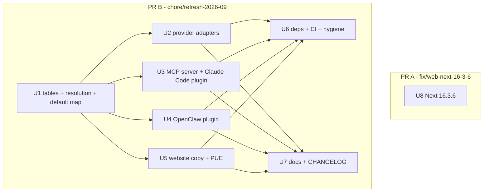
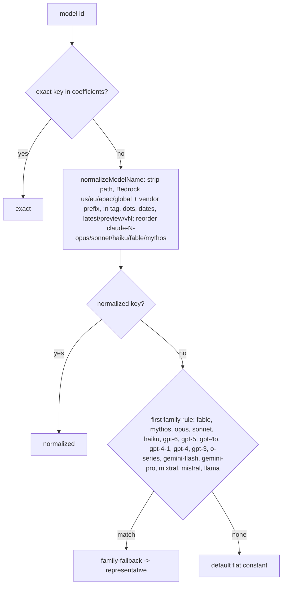

# Models, Plugins and Dependencies Refresh 2026-09 - Plan

## Goal Capsule

- **Objective:** A user of ebb-ai in September 2026 gets correct carbon and cost numbers for the models they actually run, defaults that dispatch to models that still exist, and a website that carries no critical advisory.
- **Means:** Refresh the JSON data tables and model-resolution rules first, then the consumers (provider adapters, MCP server, OpenClaw plugin, website copy, docs), then dependencies and CI, as ordered streams in git worktrees (KTD1, KTD8).
- **Authority:** This plan, then the two audits it is built from (`audit-models.md`, `audit-health.md` in the session scratchpad), then the `claude-api` skill for Claude facts. Where the plan and repo evidence disagree, stop and report.
- **Stop conditions:** a settled decision below turns out to be infeasible; a verified price cannot be found for a row the plan says to add; `pnpm preflight` fails the same way twice; a change would require a version bump, CHANGELOG date or tag.
- **Execution profile:** one integration PR plus one small web-security PR (KTD9), each from a worktree under `.worktrees/`, each ending at an open PR with green CI and a `ce-code-review` pass. Nobody merges.
- **Who finishes:** Vitalii reviews and merges; the pipeline stops at the open PRs.

---

## Product Contract

### Summary

Replace the July-2026 model catalogue with the September-2026 one: correct Claude prices (Opus 4.6/4.7 are $5/$25, not $15/$75), add current Claude, OpenAI, Gemini and open-weight rows, retire what vendors shut down, and make old model names still resolve.
Point every default at a model that exists (`claude-sonnet-5`, `gpt-6-sol`, `gemini-3.8-flash`) through one shared per-provider map.
Stop sending sampling parameters that current Claude models reject, raise the Anthropic output ceiling, and surface refusals instead of storing them as success.
Update website copy and docs to the same names and one energy convention.
Close the two critical Next.js advisories, bump the MCP SDK and SDK dev dependencies, add Node 24 to CI, and gitignore generated artifacts.

### Problem Frame

The data tables were stamped `asOf: 2026-07` and already wrong then: Opus 4.6/4.7 carry 3x their list price, so cost routing penalises them.
No current model (Opus 5, Sonnet 5, Fable, GPT-6, Gemini 3.x) has a price row, so passing one as a routing candidate throws `MissingPriceError`; `gemini-2.0-flash`, the OpenClaw Gemini default, was shut down on 2026-06-01, so every keyless Gemini dispatch fails.
`apps/web` ships `next@16.2.11`, which carries two critical unauthenticated-RCE advisories patched in 16.3.3.

### Key Decisions

- **Retired rows stay in `energy.json` flagged `status: "retired"`; their `prices.json` rows are removed.** Receipts for past runs must still resolve `exact`; a price for a model nobody can call is not a routing input, and `MissingPriceError` is the designed loud failure. Governs R3, R4.
- **Unverified prices are left out, never invented.** Only rows whose price has a named source in Appendix A get a `prices.json` entry; the rest are energy-only and therefore not routable until a price is verified. Governs R2, R5.
- **One source of truth for Wh figures on the website: `estimateEnergyKwh` from `@ebb-ai/core`, which includes PUE.** Governs R14.
- **Two PRs, not one.** The Next.js bump is a production security fix that auto-deploys through Vercel and must be revertable on its own. Governs R19.
- **No release.** `## [Unreleased]` only; root `package.json` version stays `0.1.0` unless Vitalii decides otherwise (Open Questions). Governs R21.

### Requirements

**Data tables and model resolution**

- R1. `claude-opus-4-7` and `claude-opus-4-6` are priced $5 / $25 per MTok.
- R2. Every model in Appendix A marked "add" has an `energy.json` row; those with a verified price also have a `prices.json` row, stamped `asOf: "2026-09"` with the source named in Appendix A.
- R3. Every model in Appendix A marked "retired" keeps its `energy.json` row with `status: "retired"` and has no `prices.json` row; `claude-opus-3-5` is removed from both files because it never existed.
- R4. Every model id that resolved before (`exact`, `normalized` or `family-fallback`) still resolves to coefficients after; none throws.
- R5. Family representatives point at current models: `claude-opus` -> `claude-opus-5`, `claude-sonnet` -> `claude-sonnet-5`, `gemini-flash` -> `gemini-3-8-flash`, `gemini-pro` -> `gemini-3-1-pro`; new families cover `fable`, `mythos`, `gpt-6`, `gpt-5` and `gpt-4-1` (ordered before `gpt-4`).
- R6. `normalizeModelName` (TS) and `normalize_model_name` (PY) strip the Bedrock prefixes `global.<vendor>.` and bare `<vendor>.` in addition to `us./eu./apac.`, and reorder `claude-<n>-fable` / `-mythos` like the existing `-opus|-sonnet|-haiku` rule.
- R7. The generated tables (`tables.generated.ts`, `_data.py`) are produced only by `pnpm gen:data` and carry the new `status` field.

**Provider adapters**

- R8. The Anthropic adapters (TS and PY) omit `temperature` for models that reject sampling parameters (Opus 4.7, 4.8, 5, 5.5; Sonnet 5; Fable and Mythos), per the `claude-api` skill "Thinking & Effort" table.
- R9. The Anthropic adapters default `max_tokens` to 16000 when the caller sets none, per the skill's "Common Pitfalls" (`max_tokens` defaults, non-streaming).
- R10. A response with `stop_reason: "refusal"` raises a typed provider error carrying the `stop_details.category`; a `max_tokens` stop is reported on the result as `stopReason`, never silently stored as a complete answer.
- R11. The OpenAI adapters send `max_completion_tokens` for `gpt-6*` as they already do for `gpt-5*` and o-series.

**Defaults and plugins**

- R12. One exported per-provider default map in `@ebb-ai/core` (`anthropic: claude-sonnet-5`, `openai: gpt-6-sol`, `gemini: gemini-3.8-flash`, `ollama: llama3.1`) is consumed by the MCP server and the OpenClaw plugin; a task never carries a foreign vendor's model id. `EBB_DEFAULT_MODEL` overrides the Anthropic entry only.
- R13. The OpenClaw plugin builds and passes its smoke test against the installed OpenClaw 2026.9.4 and declares that version in `openclaw.build.*`; the MCP server lists its 9 tools over stdio.

**Website and docs**

- R14. `/docs` and `/map` show current model names, and every Wh-per-call figure is computed from `estimateEnergyKwh` (500 in + 500 out, PUE 1.15) rather than typed by hand.
- R15. README, `packages/core-py/README.md`, `examples/pi/ebb-ai.md`, the Claude Code plugin command docs, JSDoc and tool descriptions name `claude-sonnet-5` / `gpt-6-sol` / `gemini-3-8-flash` where they named retired ids; the core-py routing example uses a priced id.

**Dependencies, CI, hygiene**

- R16. `apps/web` runs `next@16.3.6` and `pnpm audit --prod` reports 0 critical advisories.
- R17. `@modelcontextprotocol/sdk` is `^1.30.1`; root `pnpm.overrides` force the patched `fast-uri`, `hono`, `qs`, `sharp`, `nanoid` ranges named in the health audit; `pnpm audit --prod` reports 0 high advisories after both PRs.
- R18. `@anthropic-ai/sdk` dev dep is `^0.128.0`, `openai` dev dep is `^7.23.0` with the adapter tests green on it; `pyproject.toml` caps `anthropic<2` and `openai<4` while CI installs the latest within those caps.
- R19. CI runs the build-test matrix on Node 20, 22 and 24; the OpenClaw plugin legs run on 22 and 24.
- R20. `.gitignore` covers `.playwright-mcp/`, `packages/openclaw-plugin/reports/` and `.worktrees/`.
- R21. `CHANGELOG.md` gains entries under the existing `## [Unreleased]` heading only; no package version, lockfile version, date or tag changes.

### Scope Boundaries

**Deferred to Follow-Up Work**

- Gemini and OpenAI GPT-4.1/GPT-5 price rows: add once `ai.google.dev/pricing` and the OpenAI pricing page are fetched and read; until then those ids are energy-only, and no `gemini:` id can be a routing candidate (the retired Gemini rows lose their price in U1, and no current Gemini row has one). Gemini dispatch without routing is unaffected.
- Major dependency lines: TypeScript 7, vitest 5, eslint 10, recharts 3, commander 15, better-sqlite3 13, `@types/node` 26, pnpm 10, zod 4 with native `z.toJSONSchema` (drops `zod-to-json-schema`). Each is its own migration.
- Claude Code plugin `commands/` -> `skills/` migration, `$schema` and `userConfig` in `plugin.json`, pinning `@ebb-ai/mcp` in `.mcp.json` (would need a bump every release).
- MCP Registry `server.json`; MCP tool annotations (`readOnlyHint` / `destructiveHint`) on `tools/list`.
- Website host list (Codex, Gemini CLI, VS Code) and label refresh (Windsurf, Zed, Goose); the two `react-hooks` lint warnings.
- Raising the `@anthropic-ai/sdk` / `openai` peer floors; a `CONTRIBUTING.md` `make setup` target (a one-paragraph venv note is in scope, U7).
- GitHub Actions v7 (Dependabot PR #30) and the npm group PR #33: reported for Vitalii, not acted on.

**Outside this work**

- Any behaviour change to scheduling, routing weights, receipts or signing.
- Ollama `llama4` tag as default (tag unverified).

### Assumptions

- Energy coefficients for models without a parameter disclosure are `source: "estimated"` at the tier of the nearest priced sibling: Fable and Opus 5.x at the Opus-4 class (0.003 / 0.015), Sonnet 5 at the Sonnet-4 class, GPT-6 astra/sol/luna at the Opus/Sonnet/Haiku classes, Gemini 3.1 Pro at the 4o class, Gemini 3.8 Flash and 3.5 Flash-Lite at the Flash class, Llama 4 Scout / Maverick at the Mixtral / 70B classes (MoE active parameters), Mistral Small 4 / Medium 3.5 / Large 3 at 0.0006 / 0.001 / 0.003 input. The docs page already states closed-model coefficients may be off by +/-50%.
- The vendor id the Gemini API accepts is `gemini-3.8-flash` (dotted); the canonical table key is `gemini-3-8-flash`; `normalizeModelName` maps one to the other, as it does today for `gemini-2.0-flash`.
- The installed OpenClaw is 2026.9.4 (health audit 5c); `openclaw.build.*` is stamped with the version the plugin was actually rebuilt and validated against, not npm's latest 2026.9.6.
- `max_completion_tokens` is accepted by every current OpenAI chat model, so extending the reasoning-model branch to `gpt-6*` cannot break a model that accepted `max_tokens`.
- Tests are mocked at the SDK boundary; bumping `openai` to 7.x can break TypeScript types in `providers/openai.ts` but not runtime behaviour. Type fixes belong to U6 because U2 has landed by then.

### Open Questions

- **Root `package.json` version `0.1.0` vs `0.15.1` everywhere else.** Recommendation: leave it in this PR (a version change is what the constraint forbids, and the root is private and never published); align it in the next release commit, which already bumps versions. Vitalii decides.
- **Dependabot PR #33.** Recommendation: close as superseded once PR A (Next 16.3.6) and PR B (MCP SDK 1.30.1, minor bumps) are open. Vitalii decides; nothing in this plan closes it.
- **Dependabot PR #30 (actions v7).** Still current and green. If Vitalii merges it first, the `ci.yml` change in U6 rebases onto it in one hunk; if not, U6 leaves the action majors alone.

---

## Planning Contract

### Key Technical Decisions

- KTD1. **Foundation first.** U1 (tables, resolution, shared default map, generated files) lands on the integration branch before any consumer stream starts; every other unit depends on the new ids and the `DEFAULT_MODEL_BY_PROVIDER` export.
- KTD2. **`status` is an optional field on `energy.json` coefficient rows, passed through by `scripts/gen-data.mjs` to both generated modules and typed as `status?: "retired" | "deprecated"`.** Prices need no flag because retired models lose their price row (Key Decisions). `deprecated` marks models with an announced shutdown date that has not passed (`gpt-4`, `gpt-4-turbo`, `o3-mini`, `claude-opus-4`, `claude-sonnet-4`); they keep their price until the date passes.
- KTD3. **`DEFAULT_MODEL_BY_PROVIDER` lives in `packages/core-ts/src/providers/defaults.ts` and is re-exported from `index.ts`.** The MCP server and the OpenClaw plugin import it instead of each carrying a map; the OpenClaw plugin's existing local map is deleted.
- KTD4. **Sampling-parameter gating is an allow-list predicate on the normalized model id** (`supportsSamplingParams`), shared by `dispatch` and `dispatchBatch`, mirrored in Python. It returns true only for Claude ids known to accept sampling parameters: every Haiku id, and Opus / Sonnet ids whose version is 4.6 or lower (`claude-opus-4-6`, `claude-sonnet-4-6`, `claude-opus-4-5`, `claude-sonnet-4-5`, `claude-opus-4-1`, `claude-opus-4`, `claude-sonnet-4`, the retired 3.x ids). Every other id, including any Claude model released after this plan, returns false, so an unknown model never receives a parameter that current models reject; omitting `temperature` never breaks a request.
- KTD5. **Refusals are errors; truncation is data.** A new `ProviderRefusalError` (exported, with `category`) is thrown on `stop_reason: "refusal"`; `DispatchResult.stopReason?: string` is added and populated from the response. Whether the scheduler treats the refusal as non-retryable is decided at implementation by reading its existing transient/permanent classification (scheduler.ts near "assume non-retryable").
- KTD6. **Python `DispatchOptions.max_tokens` becomes `int | None = None`; each adapter applies its own default** (Anthropic 16000, others 1024). This keeps the OpenAI, Gemini and Ollama defaults unchanged while satisfying R9.
- KTD7. **Website Wh figures are rendered from core at request time.** Both pages are server components; they call `estimateEnergyKwh({ model })` from `@ebb-ai/core/energy` (typical 500/500 tokens, PUE-inclusive) and format Wh. Row labels stay literal strings.
- KTD8. **Worktrees under `.worktrees/`.** Integration branch `chore/refresh-2026-09` at `.worktrees/chore-refresh-2026-09`; parallel streams branch from it into `.worktrees/refresh-u<N>`; PR A at `.worktrees/fix-web-next-16-3-6` on `fix/web-next-16-3-6` from `main`. Every worktree runs `pnpm install --frozen-lockfile` (pnpm store hardlinks, cheap); only U1, U2 and U6 create a core-py venv (`python3.11 -m venv .venv && .venv/bin/pip install -e ".[dev,anthropic,openai]"` in `packages/core-py`, per its README) because only they run pytest.
- KTD9. **Two PRs.** PR A = U8 only (`apps/web/package.json` + lockfile). PR B = U1-U7. Both edit `pnpm-lock.yaml` and `CHANGELOG.md`; whichever merges second re-runs `pnpm install` and re-resolves the one-line CHANGELOG hunk.
- KTD10. **A stdio smoke script is added to the MCP server package** (`packages/mcp-server/scripts/smoke-stdio.mjs`, `pnpm --filter @ebb-ai/mcp smoke`), lifted from the health audit's scratchpad script: `initialize` then `tools/list`, expects 9 tools and prints `SMOKE_PASS`. It mirrors the OpenClaw plugin's `scripts/smoke.mjs` convention and gives U3 a repeatable acceptance check.
- KTD11. **Bake-off not run.** The one data-shape choice (flag vs remove retired rows) has a clear winner once receipts and routing are weighed; no second mechanism survived.

### High-Level Technical Design

Stream dependency and worktree layout:

Model-id resolution after U1 (order of checks unchanged; only the table and the normalizer grow):

### Stream schedule

| Unit | Worktree | Group | Files | Model tier | Simplify |
|---|---|---|---|---|---|
| U1 | `.worktrees/chore-refresh-2026-09` (integration branch) | 0 (sequential) | 13 | opus | yes |
| U2 | `.worktrees/refresh-u2` | 1 (parallel, max 4) | 11 | opus | yes |
| U3 | `.worktrees/refresh-u3` | 1 | 6 | opus | yes |
| U4 | `.worktrees/refresh-u4` | 1 | 5 | opus | yes |
| U5 | `.worktrees/refresh-u5` | 1 | 2 | sonnet (escalate to opus on a failed build) | yes |
| U6 | `.worktrees/chore-refresh-2026-09` (integration branch) | 2 (sequential, after all group-1 merges) | 7 | opus | skip (config) |
| U7 | `.worktrees/refresh-u7` | 2 (parallel with U6) | 6 | sonnet | skip (docs) |
| U8 | `.worktrees/fix-web-next-16-3-6` | independent, may start at once | 2 | sonnet | skip (config) |

Group-1 branches merge back into the integration branch one at a time (U2, U3, U4, U5) by a Haiku agent; a conflict escalates to Opus. `pnpm preflight` runs once after the last group-2 merge, not per stream.

### Sources

- Model facts: `claude-api` skill `SKILL.md` "Current Models (cached: 2026-06-24)" (prices), `shared/models.md` (Current / Legacy / Deprecated / Retired tables), "Thinking & Effort" table (sampling params), "Common Pitfalls" (`max_tokens` defaults), "Stop details" (refusal shape), "Provider Clients" (Bedrock `anthropic.` prefix). Live check when needed: `https://platform.claude.com/docs/en/about-claude/pricing.md`.
- OpenAI: `https://developers.openai.com/api/docs/models` (gpt-6 ids and prices), `https://developers.openai.com/api/docs/deprecations` (shutdown dates).
- Gemini: `https://ai.google.dev/gemini-api/docs/deprecations`.
- Repo: `scripts/gen-data.mjs` (validation: every price key must have a coefficient; every family representative must be a coefficient key), `packages/core-ts/src/energy.ts` (`normalizeModelName`, `resolveModelEnergy`), `packages/core-ts/src/routing.ts` (`priceForModel`, `MissingPriceError`), `packages/core-ts/test/fixtures/model-energy-vectors.json` (shared TS/PY parity vectors; several existing vectors change tier, see U1), `packages/openclaw-plugin/src/index.ts` (`DEFAULT_MODEL_BY_PROVIDER`), `packages/mcp-server/src/server.ts` (`defaultModel`), `packages/core-ts/src/providers/openai.ts` (`isGpt5FamilyModel`).
- Health audit logs (session scratchpad `logs/audit.log`): patched ranges `fast-uri>=3.1.6`, `hono>=4.13.5`, `qs>=6.16.0`, `sharp>=0.35.4`, `nanoid>=3.3.18`, `next>=16.3.3`; `npm view next version` on 2026-09-27 = 16.3.6.

---

## Implementation Units

### U1. Data tables, model resolution and shared defaults

- **Goal:** The JSON SSOT, the normalizer in both languages, the family rules and the new default map reflect September 2026; every old id still resolves.
- **Requirements:** R1-R7, R12 (the export half).
- **Dependencies:** none.
- **Files:** `packages/core-ts/src/data/energy.json`, `packages/core-ts/src/data/prices.json`, `scripts/gen-data.mjs`, `packages/core-ts/src/data/tables.generated.ts` (regenerated), `packages/core-py/src/ebb_ai/_data.py` (regenerated), `packages/core-ts/src/energy.ts`, `packages/core-py/src/ebb_ai/energy.py`, `packages/core-ts/src/providers/defaults.ts` (new), `packages/core-ts/src/index.ts`, `packages/core-ts/src/tool-surface.ts`, `packages/core-ts/src/types.ts`, `packages/core-py/src/ebb_ai/recommend.py`; tests `packages/core-ts/test/energy.test.ts`, `packages/core-ts/test/routing.test.ts`, `packages/core-ts/test/fixtures/model-energy-vectors.json`, `packages/core-ts/test/fixtures/routing-scoring-vectors.json`, `packages/core-py/tests/test_energy.py`, `packages/core-py/tests/test_routing.py`.
- **Approach:**
  1. Apply Appendix A row by row to `energy.json` and `prices.json`; keep coefficient values per class exactly as the existing rows of that class; omit `paramsB` where unknown; set `asOf: "2026-09"` and the Appendix source only on rows added or corrected; leave untouched rows at `asOf: "2026-07"`; set the file-level `asOf` to `"2026-09"`.
  2. Rewrite `families` in the order of the resolution diagram; `contains: ["fable"]` and `contains: ["mythos"]` both point at `claude-fable-5-1`.
  3. Extend `scripts/gen-data.mjs` so `status` on a coefficient row is emitted in TS and PY output (KTD2); add `status?` to `ModelEnergyCoefficients` in `energy.ts` and the matching Python type.
  4. In `normalizeModelName` / `normalize_model_name`, widen the Bedrock regex to `^(?:(?:us|eu|apac|global)\.)?(?:anthropic|meta|amazon|cohere|mistral|ai21|stability)\.` and add `fable|mythos` to the reorder alternation; keep the two implementations line-for-line parallel.
  5. Add `providers/defaults.ts` with `DEFAULT_MODEL_BY_PROVIDER` per R12 and export it from `index.ts`.
  6. Replace the example ids in the JSDoc / tool descriptions at `energy.ts` (`model` field comment), `types.ts` (model comment), `tool-surface.ts` (candidates example -> `['anthropic:claude-haiku-4-5','openai:gpt-6-luna','ollama:llama-3-1-8b']`, all priced per Appendix A, because the same description says an unpriced candidate rejects the task; model description -> `claude-sonnet-5` / `gpt-6-sol`), `recommend.py` (docstring). Regenerate the tool-surface snapshot in `packages/core-ts/test/__snapshots__` if it changes.
  7. Replace every Gemini routing candidate in `packages/core-ts/test/fixtures/routing-scoring-vectors.json`, `routing.test.ts` and `test_routing.py`: `gemini:gemini-2-0-flash` -> `openai:gpt-6-luna` (cheapest hosted priced id); the equal-price tie pair `gemini-1-5-pro` / `gemini-2-0-pro` -> `anthropic:claude-opus-5` / `anthropic:claude-opus-4-8`; update expected winners and reasoning strings in both languages from the same fixture.
  8. Run `pnpm gen:data` and commit both generated files.
- **Patterns to follow:** existing row shape in both JSON files; `$comment` headers stay; the fixture's four-tier coverage test in `test_energy_parity.py` / `energy-parity.test.ts`.
- **Test scenarios:**
  - `priceForModel("claude-opus-4-7")` returns 5 / 25; same for `claude-opus-4-6`.
  - `priceForModel` returns a price for `claude-opus-5`, `claude-opus-5-5`, `claude-opus-4-8`, `claude-sonnet-5`, `claude-fable-5-1`, `claude-fable-5`, `gpt-6-astra`, `gpt-6-sol`, `gpt-6-luna`.
  - `priceForModel("o1-mini")` and `priceForModel("gemini-2-0-flash")` return undefined; routing with `["openai:o1-mini"]` throws `MissingPriceError` naming `o1-mini`.
  - The routing-scoring fixture (shared by `routing.test.ts` and `test_routing.py`) passes in both languages with its Gemini candidates replaced per Approach step 7; the tie test still proves a deterministic winner on equal price and class.
  - `resolveModelEnergy("claude-sonnet-3-5")` resolves `exact` with `status: "retired"`; `resolveModelEnergy("claude-3-5-sonnet-20241022")` resolves `normalized`.
  - `resolveModelEnergy("claude-opus-5")` and `("llama-4-scout")` now resolve `exact` (update the two existing fixture vectors; `llama-4-scout` source becomes `estimated`).
  - `resolveModelEnergy("claude-opus-6")` resolves `family-fallback` with Opus-5 coefficients; `("claude-mythos-5-1")` resolves `family-fallback` to Fable coefficients; `("gemini-4-flash")` to `gemini-3-8-flash` coefficients.
  - `normalizeModelName("global.anthropic.claude-sonnet-5")`, `("anthropic.claude-opus-5")`, `("us.anthropic.claude-opus-4-1-v1:0")` all reach the canonical id; `("gpt-4.1-mini")` -> `gpt-4-1-mini` resolves `exact` via the new row, and `("gpt-4-1-ultra")` falls back to `gpt-4-1`, not `gpt-4`.
  - Every scenario above is added as a vector to `model-energy-vectors.json` so the Python parity suite proves the same result.
  - `DEFAULT_MODEL_BY_PROVIDER` has exactly the four keys and values of R12.
  - Generated output: `pnpm gen:data:check` is clean; a coefficient with `status` renders in both TS and PY output; a `prices.json` key without a coefficient still throws in the generator.
- **Verification:** `pnpm gen:data:check`, `pnpm --filter @ebb-ai/core test`, `packages/core-py` ruff + pytest green; a node one-liner against `packages/core-ts/dist` shows `resolveModelEnergy("claude-fable-5-1").tier === "exact"` and `priceForModel("claude-sonnet-5")` defined.

### U2. Provider adapters: sampling params, output ceiling, stop reasons, GPT-6

- **Goal:** Dispatches to current Claude models succeed, do not truncate at 1024 tokens, and refusals fail loudly; GPT-6 gets the reasoning-model parameters.
- **Requirements:** R8-R11.
- **Dependencies:** U1.
- **Files:** `packages/core-ts/src/providers/anthropic.ts`, `packages/core-ts/src/providers/openai.ts`, `packages/core-ts/src/providers/base.ts`, `packages/core-ts/src/providers/index.ts`, `packages/core-py/src/ebb_ai/providers/anthropic.py`, `packages/core-py/src/ebb_ai/providers/openai.py`, `packages/core-py/src/ebb_ai/providers/gemini.py`, `packages/core-py/src/ebb_ai/providers/ollama.py`, `packages/core-py/src/ebb_ai/providers/base.py`, `packages/core-py/src/ebb_ai/scheduler.py` (the two `DispatchOptions(...)` constructions only); tests `packages/core-ts/test/providers.test.ts`, `packages/core-py/tests/test_providers.py`, `packages/core-py/tests/test_scheduler.py`.
- **Approach:**
  1. Add `supportsSamplingParams(model)` (KTD4) next to the adapter; build the request without `temperature` when it returns false, in both `dispatch` and `dispatchBatch`.
  2. Default `max_tokens` to 16000 in the TS adapter; in Python apply KTD6: `base.py` default becomes `None`; `anthropic.py` applies 16000, `openai.py`, `gemini.py` (`maxOutputTokens`) and `ollama.py` (`num_predict`) apply 1024 when `None`, so their existing `is not None` guards no longer drop the cap; `scheduler.py` passes `max_tokens=spec.max_tokens` through unchanged at both construction sites (today it substitutes 1024 itself, which would bypass the adapter default).
  3. After `messages.create`, read `stop_reason`; on `refusal` throw `ProviderRefusalError` (defined in `base.ts` / `base.py`, exported through `providers/index.ts` and `core-ts/src/index.ts`) with `category` from `stop_details`; otherwise set `stopReason` on the result (KTD5). If the batch-result reader in core reads per-result content, apply the same check there; record in the PR if it does not.
  4. Rename `isGpt5FamilyModel` to cover `gpt-6*` too, in both languages.
  5. Update the example ids in `base.ts` (`model` comment).
- **Patterns to follow:** the existing `completionParams` / `_completion_params` split in the OpenAI adapters; mocked-client tests in `providers.test.ts` and `test_providers.py`.
- **Test scenarios:**
  - Dispatch to `claude-sonnet-5` with `temperature: 0.2`: the mocked client receives no `temperature` key; to `claude-sonnet-4-6` it receives `temperature: 0.2`; to `claude-haiku-4-5` it receives it; to an unknown future id such as `claude-opus-6` it receives none.
  - `dispatchBatch` to `claude-opus-5` with a temperature: no `params.temperature` in any request.
  - Dispatch with no `maxTokens`: request carries `max_tokens: 16000`; with `maxTokens: 512` it carries 512.
  - Python: `DispatchOptions()` sent to the OpenAI adapter still yields 1024; to the Anthropic adapter 16000; the Gemini adapter still sends `maxOutputTokens: 1024` and the Ollama adapter `num_predict: 1024`.
  - Python scheduler: a scheduled Anthropic `provider_call` with no `max_tokens` reaches the mocked client with `max_tokens: 16000`; with `max_tokens: 512` it reaches it with 512; the batch-submit path behaves the same.
  - Mocked response `stop_reason: "refusal"`, `stop_details: { category: "cyber" }`: `dispatch` rejects with `ProviderRefusalError` whose `category` is `"cyber"`; nothing is returned as text.
  - Mocked `stop_reason: "max_tokens"`: result has `stopReason === "max_tokens"` and the text.
  - OpenAI `gpt-6-sol`: request carries `max_completion_tokens` and no `max_tokens`; `gpt-4o` unchanged.
- **Verification:** `pnpm --filter @ebb-ai/core test` and `pytest tests/test_providers.py` green; `pnpm typecheck` clean.

### U3. MCP server defaults, smoke script; Claude Code plugin docs

- **Goal:** A `schedule_task` without a model gets the right vendor's current model; the server has a repeatable stdio smoke.
- **Requirements:** R12 (consumer half), R13 (MCP half), R15 (plugin docs).
- **Dependencies:** U1.
- **Files:** `packages/mcp-server/src/server.ts`, `packages/mcp-server/scripts/smoke-stdio.mjs` (new), `packages/mcp-server/package.json` (scripts only, no dependency changes), `packages/claude-code-plugin/commands/defer.md`; tests `packages/mcp-server/test/server.protocol.test.ts`, `packages/mcp-server/test/server.real.test.ts`.
- **Approach:**
  1. Replace the single `defaultModel` with a resolver: `model ?? (provider === "anthropic" ? (deps.defaultModel ?? EBB_DEFAULT_MODEL ?? map.anthropic) : map[provider])`, used identically by the `dry_run` preview and the real enqueue.
  3. Add `scripts/smoke-stdio.mjs` (KTD10) and a `smoke` script entry.
  4. In `defer.md`, replace `claude-sonnet-4-6` with `claude-sonnet-5` and describe the per-provider default.
- **Patterns to follow:** the existing `dry_run` / enqueue symmetry comment in `server.ts`; the OpenClaw `scripts/smoke.mjs` shape.
- **Test scenarios:**
  - `schedule_task` with `provider: "openai"`, no model, `dry_run: true`: preview shows `model: gpt-6-sol`; `provider: "gemini"` shows `gemini-3.8-flash`; no provider shows `claude-sonnet-5`.
  - `EBB_DEFAULT_MODEL=claude-opus-5` with `provider: "openai"` still yields `gpt-6-sol`; with no provider yields `claude-opus-5`.
  - `tools/list` returns 9 tools.
  - Smoke script against `dist/server.js` prints `INIT_OK`, `TOOLS_OK 9`, `SMOKE_PASS` and exits 0.
- **Verification:** `pnpm --filter @ebb-ai/mcp build && pnpm --filter @ebb-ai/mcp test && pnpm --filter @ebb-ai/mcp smoke`.

### U4. OpenClaw plugin defaults and compat stamp

- **Goal:** Keyless Gemini dispatch no longer targets a shut-down model; the plugin is rebuilt and validated against OpenClaw 2026.9.4.
- **Requirements:** R12 (consumer half), R13 (OpenClaw half).
- **Dependencies:** U1.
- **Files:** `packages/openclaw-plugin/src/index.ts`, `packages/openclaw-plugin/scripts/smoke.mjs`, `packages/openclaw-plugin/package.json` (the `openclaw` key only), `packages/openclaw-plugin/openclaw.plugin.json` (only if the `ollamaModels` example changes; default: untouched); test `packages/openclaw-plugin/test/plugin.test.ts`.
- **Approach:**
  1. Delete the local `DEFAULT_MODEL_BY_PROVIDER`; import it from `@ebb-ai/core`.
  2. `smoke.mjs`: `claude-sonnet-4-6` -> `claude-sonnet-5`.
  3. `openclaw.build.openclawVersion` and `pluginSdkVersion` -> `2026.9.4`; leave `compat` floors as they are.
  4. Rebuild, then run `openclaw plugins validate --root packages/openclaw-plugin --entry ./dist/index.js` (README "Local development") against the installed 2026.9.4.
- **Test scenarios:**
  - A task scheduled with `provider: "gemini"` and no model carries `gemini-3.8-flash`; `openai` carries `gpt-6-sol`; `anthropic` carries `claude-sonnet-5`; `ollama` still carries `llama3.1`.
  - Existing plugin tests that assert the old defaults are updated, not deleted.
- **Verification:** `pnpm --filter @vitalini/ebb build && pnpm --filter @vitalini/ebb test && pnpm --filter @vitalini/ebb smoke`; `openclaw plugins validate` exits 0; `openclaw --version` recorded in the PR body.

### U5. Website copy and one Wh convention

- **Goal:** `/docs` and `/map` name current models and agree on every Wh figure.
- **Requirements:** R14.
- **Dependencies:** U1.
- **Files:** `apps/web/src/app/docs/page.tsx`, `apps/web/src/app/map/page.tsx`.
- **Approach:**
  1. Import `estimateEnergyKwh` from the pure `@ebb-ai/core/energy` subpath in both pages (KTD7), not the root barrel, which pulls the sqlite `TaskStore` and node-only modules into the Next server bundle; a small local helper formats `estimateEnergyKwh({ model }) * 1000` as `~N Wh`.
  2. Rebuild the coefficient table rows by class: 0.003/0.015 `claude-opus-5 · claude-fable-5-1 · gpt-6-astra · o3`; 0.002/0.01 `gpt-4o · gemini-3.1-pro` (new row); 0.001/0.005 `claude-sonnet-5 · gpt-6-sol · llama-3.1-70b`; 0.0003-0.0006/0.0015-0.003 `claude-haiku-4-5 · gpt-6-luna · gemini-3.8-flash · gpt-4o-mini`; 0.0002/0.001 `llama-3.1-8b · mistral-7b`; 0.005/0.025 `llama-3.1-405b`. The "Typical call" cell of each row is computed from the first model in the row.
  3. Code sample `model: "claude-sonnet-4"` -> `"claude-sonnet-5"`; sample receipt `model claude-sonnet-4-5` -> `claude-sonnet-5`.
  4. `/map` scoring paragraph: model names to `claude-sonnet-5`, `claude-opus-5`, `claude-haiku-4-5`, `llama-3.1-8b`, each figure computed, text "(500 in + 500 out, PUE 1.15)".
- **Test scenarios:** `Test expectation: none -- apps/web has no unit-test runner; verification is the production build plus a rendered-output check.`
- **Verification:** `pnpm --filter @ebb-ai/core build && pnpm --filter ./apps/web build && pnpm --filter ./apps/web lint` (0 errors); then `pnpm --filter ./apps/web start -p <free port>` and `curl -s localhost:<port>/docs` and `/map`, asserting both responses contain `~3.5 Wh` (Sonnet 5) and `~10.4 Wh` (Opus 5). Pages render dynamically behind the nonce CSP proxy, so there is no prerendered HTML file to grep.

### U6. Dependencies, overrides, CI matrix, gitignore

- **Goal:** Advisories reachable from the monorepo (other than `next` itself) are closed, SDK dev deps are current, CI covers Node 24, generated artifacts are ignored.
- **Requirements:** R17-R20.
- **Dependencies:** U2, U3, U4, U5 merged into the integration branch.
- **Files:** `package.json` (root `pnpm.overrides`), `pnpm-lock.yaml`, `packages/mcp-server/package.json`, `packages/core-ts/package.json`, `packages/core-py/pyproject.toml`, `.github/workflows/ci.yml`, `.gitignore`; possibly `packages/core-ts/src/providers/openai.ts` for type-only fixes after the `openai` 7 bump.
- **Approach:**
  1. `@modelcontextprotocol/sdk` `~1.29.0` -> `^1.30.1`; `@anthropic-ai/sdk` dev `^0.128.0`; `openai` dev `^7.23.0`; peer ranges unchanged.
  2. Root overrides: add `fast-uri@<3.1.6: >=3.1.6`, `hono@<4.13.5: >=4.13.5`, `nanoid@<3.3.18: >=3.3.18`; rewrite the two existing entries as `qs@<6.16.0: >=6.16.0` and `sharp@<0.35.4: >=0.35.4` (the current selectors `qs@>=6.11.1 <=6.15.1` and `sharp@<0.35.0` do not match the locked `qs@6.15.3` / `sharp@0.35.3`, so raising only the targets would leave them in place); keep `@hono/node-server` and `postcss`.
  3. `pyproject.toml`: `anthropic>=0.39,<2`, `openai>=1.50,<4` in both the extras and `dev`.
  4. `pnpm install` (lockfile refresh) then `pnpm update -r --filter '!./apps/web'` for in-range minors (tsx, typebox, esbuild); leave `apps/web` out entirely, ranges and resolutions alike, because `^16.2.11` would otherwise resolve `next` to 16.3.6 inside PR B and defeat KTD9. After the update, confirm `pnpm-lock.yaml` on the integration branch still resolves `next@16.2.11`.
  5. `ci.yml`: matrix `["20", "22", "24"]`; the two OpenClaw-plugin `if:` gates become `matrix.node != '20'`. Do not touch action majors (Open Questions, PR #30).
  6. `.gitignore`: append `.playwright-mcp/`, `packages/openclaw-plugin/reports/`, `.worktrees/`.
- **Execution note:** dependency work; prefer install + audit + full test-suite proof over new unit tests.
- **Test scenarios:** `Test expectation: none -- config-only; proof is the gates below.`
- **Verification:** `pnpm install --frozen-lockfile` succeeds; `pnpm-lock.yaml` still pins `next@16.2.11`; `pnpm audit --prod` shows 0 high and only the two `next` criticals (which PR A closes); `pnpm preflight` green; `git status` shows `.playwright-mcp/` and `reports/` no longer untracked.

### U7. Docs, examples, CHANGELOG

- **Goal:** Every documented model id and example runs against a model that exists and has a price.
- **Requirements:** R15, R21.
- **Dependencies:** U2-U5 merged (so the CHANGELOG describes landed behaviour).
- **Files:** `README.md`, `packages/core-py/README.md`, `examples/pi/ebb-ai.md`, `CHANGELOG.md`, `CONTRIBUTING.md`, `packages/openclaw-plugin/README.md` (only if it names a default model; check).
- **Approach:**
  1. `claude-sonnet-4-5` -> `claude-sonnet-5` in README (two places), core-py README (two places), `examples/pi/ebb-ai.md`; core-py routing example `gpt-4.1-mini` -> `gpt-6-sol`.
  2. `CHANGELOG.md` under `## [Unreleased]`: `### Changed` (model catalogue 2026-09, per-provider defaults, family representatives, `status` flag, Anthropic `max_tokens` 16000, CI Node 24), `### Fixed` (Opus 4.6/4.7 price, Gemini default, foreign-vendor default, sampling params, refusal handling), `### Security` (MCP SDK 1.30.1 and overrides; the Next entry is added by PR A). No date, no version.
  3. `CONTRIBUTING.md`: one paragraph on creating the core-py venv so `pnpm preflight` works (health audit P1-2).
  4. Leave `docs/papers/`, `docs/archive/`, `docs/release/` untouched (historical).
- **Test scenarios:** `Test expectation: none -- documentation; the stale-id sweep in the Verification Contract is the check.`
- **Verification:** the stale-id sweep returns only historical files; `pnpm --filter @ebb-ai/cli test` (docs-lockstep) green.

### U8. Next.js 16.3.6 (PR A)

- **Goal:** The two critical Next.js advisories are closed in production.
- **Requirements:** R16.
- **Dependencies:** none; independent of PR B.
- **Files:** `apps/web/package.json`, `pnpm-lock.yaml`; `CHANGELOG.md` (one `### Security` line under Unreleased).
- **Approach:** `next` `^16.2.11` -> `^16.3.6` and `eslint-config-next` to the same version; `pnpm install`; build and lint; no other change. If the build surfaces a Next 16.3 deprecation, record it in the PR and stop rather than widen the PR.
- **Execution note:** packaging change; smoke-verify with the production build, not unit tests.
- **Test scenarios:** `Test expectation: none -- dependency bump; proof is the build and the audit.`
- **Verification:** `pnpm --filter @ebb-ai/core build && pnpm --filter ./apps/web build && pnpm --filter ./apps/web lint` (0 errors); `pnpm audit --prod` shows 0 critical; Vercel preview deploy on the PR renders `/`, `/docs`, `/map`.

---

## Verification Contract

| Gate | Command (from repo root unless noted) | Applies to |
|---|---|---|
| Data SSOT | `pnpm gen:data:check` | U1, final |
| Core TS tests | `pnpm --filter @ebb-ai/core test` | U1, U2, U6 |
| Python | `cd packages/core-py && .venv/bin/ruff check . && .venv/bin/pytest -q` | U1, U2, U6 |
| Typecheck | `pnpm typecheck` | every group-1 stream, U6 |
| MCP | `pnpm --filter @ebb-ai/mcp build && pnpm --filter @ebb-ai/mcp test && pnpm --filter @ebb-ai/mcp smoke` | U3, final |
| OpenClaw | `pnpm --filter @vitalini/ebb build && pnpm --filter @vitalini/ebb test && pnpm --filter @vitalini/ebb smoke`; `openclaw plugins validate --root packages/openclaw-plugin --entry ./dist/index.js` | U4, final |
| Web | `pnpm --filter @ebb-ai/core build && pnpm --filter ./apps/web build && pnpm --filter ./apps/web lint` | U5, U8, final |
| Full gate | `pnpm preflight` | once after the last group-2 merge; once on PR A |
| Audit | `pnpm audit --prod` | PR A: 0 critical; PR B: 0 high; both merged: 0 critical, 0 high |
| Stale-id sweep | `grep -rn "claude-sonnet-4-5\|claude-sonnet-4-6\|gemini-2.0-flash\|gemini-2-0-flash" --include="*.ts" --include="*.tsx" --include="*.py" --include="*.md" --include="*.json" --include="*.mjs" --exclude-dir=node_modules --exclude-dir=.venv --exclude-dir=.worktrees --exclude-dir=.next --exclude-dir=dist . \| grep -v "CHANGELOG.md\|docs/papers\|docs/archive\|docs/release\|docs/plans\|tables.generated\|_data.py\|energy.json\|prices.json\|model-energy-vectors\|routing-scoring-vectors\|\.test\.\|tests/test_"` returns nothing (`gpt-4o` is a kept model and is not swept) | final |
| CI | all checks green on both PRs | final |
| Review | `ce-code-review` on each PR, blockers fixed | final |

Logs are read with `grep -nE "✘|Error|expected|FAIL" <log> | head -40`, never whole. A gate that fails the same way twice is a finding for the orchestrator, not a retry.

---

## Definition of Done

- Both PRs open against `main`, CI green, `ce-code-review` done with no open blocker; neither merged.
- R1-R21 each traceable to a landed unit; Appendix A applied exactly, with no price row lacking a named source.
- `pnpm preflight` green on the integration branch; the stale-id sweep returns nothing.
- `CHANGELOG.md` `## [Unreleased]` describes the change; no version, date, tag or lockfile-version change anywhere.
- No experimental or abandoned code in either diff; the scratchpad smoke script exists in the repo only as `packages/mcp-server/scripts/smoke-stdio.mjs`.
- Open Questions reported to Vitalii with the recommendation stated; PR #30 and #33 untouched.
- Worktrees listed in the final report so they can be removed after merge (`git worktree remove`, `git branch -d`).

---

## Appendix

### Appendix A. Model row ledger

Sources: [C-price] = `claude-api` skill `SKILL.md` "Current Models (cached: 2026-06-24)"; [C-status] = `claude-api` skill `shared/models.md` Current / Legacy / Deprecated / Retired tables; [OA-models] = `https://developers.openai.com/api/docs/models`; [OA-dep] = `https://developers.openai.com/api/docs/deprecations`; [G-dep] = `https://ai.google.dev/gemini-api/docs/deprecations`; [keep] = existing row, not re-verified, `asOf` unchanged. Energy classes are the Assumptions above unless a row says otherwise.

| Canonical id | prices.json | energy.json | Status / source |
|---|---|---|---|
| claude-fable-5-1 | add 10 / 50, batch 0.5 | add, Opus class, estimated | current [C-price] |
| claude-fable-5 | add 10 / 50, batch 0.5 | add, Opus class | current [C-price] |
| claude-opus-5-5 | add 4 / 20, batch 0.5 | add, Opus class | current, launching [C-price] |
| claude-opus-5 | add 5 / 25, batch 0.5 | add, Opus class | current [C-price]; new `claude-opus` representative |
| claude-opus-4-8 | add 5 / 25, batch 0.5 | add, Opus class | current [C-price] |
| claude-opus-4-7 | fix 15/75 -> 5 / 25 | keep | current [C-price] |
| claude-opus-4-6 | fix 15/75 -> 5 / 25 | keep | current [C-price] |
| claude-sonnet-5 | add 2 / 10, batch 0.5 | add, Sonnet class | current [C-price]; new `claude-sonnet` representative |
| claude-sonnet-4-6 | keep 3 / 15 (matches [C-price]) | keep | current |
| claude-haiku-4-5 | keep 1 / 5 (matches [C-price]) | keep | current |
| claude-opus-4-5 | none (not in [C-price]) | add, Opus class | legacy active [C-status] |
| claude-sonnet-4-5 | [keep] 3 / 15 | keep | legacy active [C-status] |
| claude-opus-4-1 | remove | keep, `status: retired` | retired 2026-08-05 [C-status Legacy] |
| claude-opus-4 | [keep] 15 / 75 | keep, `status: deprecated` | deprecated, date TBD [C-status] |
| claude-sonnet-4 | [keep] 3 / 15 | keep, `status: deprecated` | deprecated, date TBD [C-status] |
| claude-opus-3-5 | remove | remove | never existed (absent from every [C-status] table) |
| claude-opus-3 | remove | keep, retired | retired 2026-01-05 [C-status] |
| claude-sonnet-3-7 | remove | keep, retired | retired 2026-02-19 [C-status] |
| claude-sonnet-3-5 | remove | keep, retired | retired 2025-10-28 [C-status] |
| claude-sonnet-3 | remove | keep, retired | retired 2025-07-21 [C-status] |
| claude-haiku-3-5 | remove | keep, retired | retired 2026-02-19 [C-status] |
| claude-haiku-3 | remove | keep, retired | retirement date 2026-04-19 passed [C-status Deprecated] |
| gpt-6-astra | add 10 / 50, batch 0.5 | add, Opus class | current [OA-models] |
| gpt-6-sol | add 2 / 10, batch 0.5 | add, Sonnet class | current [OA-models]; `gpt-6` representative |
| gpt-6-luna | add 0.10 / 0.50, batch 0.5 | add, Haiku class | current [OA-models] |
| gpt-5, gpt-5-mini, gpt-5-nano | none (price unverified) | add: Opus / mini (0.0006, 0.003) / Haiku classes | current per existing `isGpt5FamilyModel`; `gpt-5` representative = `gpt-5` |
| gpt-4-1, gpt-4-1-mini, gpt-4-1-nano | none (price unverified) | add: 4o / mini / Haiku classes | family `gpt-4-1` ordered before `gpt-4`, representative `gpt-4-1` |
| gpt-4o, gpt-4o-mini, o1, o3, gpt-3-5-turbo | [keep] | keep | [keep] |
| gpt-4, gpt-4-turbo, o3-mini | [keep] until shutdown | keep, `status: deprecated` | shutdown 2026-10-23 [OA-dep] |
| o1-mini | remove | keep, retired | shut down 2025-10-27 [OA-dep] |
| gemini-3-1-pro | none (price unverified) | add, 4o class | current [G-dep]; `gemini-pro` representative |
| gemini-3-8-flash | none | add, Flash class | current, GA 2026-09-02 [G-dep]; `gemini-flash` representative |
| gemini-3-5-flash-lite | none | add, Flash class | current [G-dep] |
| gemini-2-0-flash, gemini-2-0-pro | remove | keep, retired | shut down 2026-06-01 [G-dep] |
| gemini-1-5-pro, gemini-1-5-flash | remove | keep, retired | shut down [G-dep] |
| llama-4-scout | add 0 / 0 (self-hosted convention) | add 0.0006 / 0.003 estimated | plausible [S5 in audit]; `llama` representative stays `llama-3-1-70b` (measured) |
| llama-4-maverick | add 0 / 0 | add 0.001 / 0.005 estimated | plausible |
| mistral-small-4, mistral-medium-3-5, mistral-large-3 | add 0 / 0 | add 0.0006 / 0.001 / 0.003 input, 5x output, estimated | plausible; `mistral` representative stays `mistral-7b` |
| all other existing rows | [keep] | keep | unchanged |

Family order after U1: claude-fable, claude-mythos, claude-opus, claude-sonnet, claude-haiku, gpt-6, gpt-5, gpt-4o, gpt-4-1, gpt-4, gpt-3, openai-o, gemini-flash, gemini-pro, mixtral, mistral, llama.
