# InfoQ Article Preparation - Plan

## Goal Capsule

- **Objective:** An InfoQ editor who clicks through from the article to the site, the README and npm finds one version number that is actually installable, one reproducible example run, and no number without a stated source.
- **Means:** Six commits on `chore/infoq-article-prep`, one per brief item in brief order (KTD1), streams sequenced where they share files (KTD6), ending at one open PR against `main`.
- **Authority:** Vitalii's brief (session scratchpad `brief-infoq.md`), then this plan, then the two scout reports (`run-tick.md`, `claims-inventory.md` in the session scratchpad), then the `claude-api` skill for any Claude model id, price or Batch discount. Where the plan and repo evidence disagree, stop and report.
- **Stop conditions:** a number would have to be invented to fill a section; a real `ebb tick` run and the fixture fallback both fail; `pnpm preflight` or the web build fails the same way twice; any step would tag, publish to npm or PyPI, deploy, or merge.
- **Execution profile:** one worktree for the sequential chain (U1-U4, U6), one side worktree for U5; commits integrated in brief order; `ce-code-review` once on the final PR.
- **Who finishes:** the pipeline stops at an open, reviewed PR with green CI. Vitalii decides publish, tag and merge; a merge to `main` is a Vercel production deploy.

---

## Product Contract

### Summary

Prepare release 0.16.0 without publishing it: bump every lockstep manifest, turn `[Unreleased]` into a dated 0.16.0 section that also explains the npm gap since 0.13.0, and make README and site read the same version from one source.
Replace the synthetic `recommendWindow()` output in README with a real `ebb tick` run whose raw output lives in `docs/examples/`.
Label every quantitative claim on the site and README as measured, simulated or projected with its source, drop the unsourced ones, and record all of them in `docs/claims.md`.
Add an authorship line to the homepage.
Write two documents only: an aggregate-impact proposal and article notes.

### Problem Frame

npm has `@ebb-ai/core`, `@ebb-ai/mcp` and `@ebb-ai/cli` at 0.13.0 (published 2026-07-16).
The repo manifests, README status line (`README.md:75`) and site (`apps/web/src/app/page.tsx:71`, `apps/web/src/app/layout.tsx:90`, `apps/web/src/app/layout.tsx:149`) say 0.15.1.
PyPI `ebb-ai` does have 0.13.0 through 0.15.1 (0.15.1 uploaded 2026-07-25), so only npm skipped 0.14.0-0.15.1; tags `v0.14.0`, `v0.14.1`, `v0.15.0`, `v0.15.1` exist.
`[Unreleased]` in `CHANGELOG.md` holds two months of work (September model catalogue, `DEFAULT_MODEL_BY_PROVIDER` export, adapter behaviour changes, security bumps).
The README example (`README.md:47-67`) prints fabricated-looking values (`intensityGCo2PerKwh: 60`, `estimatedSavingsVsNowPct: 73`) with no run behind them.
Site and README carry headline numbers (a lower-carbon percentage range, 50 % cheaper, 31 regions, five feeds, 72-hour forecast) whose provenance is not stated next to them.
The site's version string is typed by hand in three places, which is how it drifted.

### Key Decisions

- **Next version is 0.16.0.** `0.15.1` is already taken on PyPI and by a tag, so the release must be above it; `[Unreleased]` contains new public API (`DEFAULT_MODEL_BY_PROVIDER`) and behaviour changes (refusals now raise `ProviderRefusalError`, new defaults), which is a minor bump under 0.x semver, not a patch. Governs R1.
- **Keep the 0.14.0-0.15.1 CHANGELOG sections as they are.** They are real tagged releases and are on PyPI; rewriting them would falsify history. The 0.16.0 section adds one note that npm jumps from 0.13.0 to 0.16.0 and points at those sections. Governs R2.
- **A claim without a source is removed from copy, not softened.** Governs R8, R9.
- **Unknown facts in the documents are written as "unknown" and listed under "Needs Vitalii".** No estimates, no anecdotes. Governs R12, R13.

### Requirements

**Release preparation (brief item 1)**

- R1. Every lockstep manifest reads `0.16.0`: `packages/core-ts/package.json`, `packages/cli/package.json`, `packages/mcp-server/package.json`, `packages/openclaw-plugin/package.json`, `packages/openclaw-plugin/openclaw.plugin.json`, `packages/claude-code-plugin/.claude-plugin/plugin.json`, `.claude-plugin/marketplace.json`, `packages/core-py/pyproject.toml`; `pnpm-lock.yaml` is refreshed and committed if it changes. Root `package.json` (private, `0.1.0`) and `apps/web/package.json` (private) are not bumped.
- R2. `CHANGELOG.md` has `## [0.16.0] — 2026-09-30` in place of `## [Unreleased]`, an empty `## [Unreleased]` above it, and a first bullet stating that npm goes from 0.13.0 to 0.16.0 and that 0.14.0-0.15.1 shipped to PyPI and git tags only, with links to those sections.
- R3. README status line and every site version string show `v0.16.0`, and the site gets it from one import, not a literal (KTD2).
- R4. A check fails `pnpm preflight` when any lockstep manifest, the README status line, or the newest dated CHANGELOG heading disagrees with `packages/core-ts/package.json` (KTD3).
- R5. The release commit does not tag, publish, or change CI.

**Real example run (brief item 2)**

- R6. `docs/examples/<YYYY-MM-DD>-<region>-tick/` holds the exact command sequence, the raw stdout/stderr, the signed receipt JSON, and the `ebb verify` result, all from one run on a named region and date.
- R7. README's synthetic snippet is replaced by an excerpt of that run: region, date, recommended window, the receipt, and a peak-vs-recommended table, each value traceable to a line in the raw output. Carbon intensity compares the forecast peak with the recommended window. ebb has no price that varies by window (cost is token list price times model price, `packages/core-ts/src/routing.ts`), so the price row compares the sync cost with the Batch cost for the same task as the run reports it, labelled as list-price estimate. The run's provenance label (live feed or bundled fixture) is stated in the first line of the README block and in the example folder (KTD4).

**Claims audit (brief item 3)**

- R8. `docs/claims.md` lists every quantitative claim on the site and in README with `file:line`, the claim text, the class (measured, simulated, projected), the source, and the action taken (kept, relabelled, dropped).
- R9. In copy, each kept claim carries its class and a source link or reference next to it; each claim with no source is removed, and every removed claim is listed in the PR body.

**Homepage authorship (brief item 4)**

- R10. The homepage shows exactly one line, "Built by Vitalii Borovyk, independent and open source", linking to `https://github.com/Vitalini/ebb-ai` and `/about`.

**Documents (brief items 5 and 6)**

- R11. `docs/impact-proposal.md` proposes, without building, an opt-in anonymized aggregate of runs scheduled, estimated gCO2 avoided and regions, with the privacy tradeoffs of each design option and a recommendation.
- R12. `docs/article-notes.md` has five sections: origin story in five bullets, three hardest technical decisions each with the rejected alternative, what was measured and what could not be, what did not work (adoption), what we would do differently. Every statement cites a commit, CHANGELOG section, or file under `docs/`.
- R13. Both documents contain no marketing language and no facts outside git history, `CHANGELOG.md`, `docs/`, `docs/solutions/`, `docs/papers/`, `docs/spec/`, `docs/claims.md` and `docs/examples/`; each unknown is written "unknown" and repeated in a closing "Needs Vitalii" list.

### Scope Boundaries

- No `npm publish`, no PyPI upload, no `git tag`, no merge, no Vercel deploy.
- No change to scheduler, feed or pricing logic; U1 touches code only for the version import and the drift check.
- `/your-impact` in the brief is the existing `/stats` route (`apps/web/src/app/stats/page.tsx`, title "Your impact"); it is not renamed and nothing on it is built.
- `docs/release/<version>/` bundles (PDFs, diagrams) are not produced for 0.16.0.
- Package-level READMEs (`packages/*/README.md`) are in the claims audit only if the claims inventory lists them; otherwise untouched.

### Assumptions

- The scouts' `run-tick.md` and `claims-inventory.md` are complete when U2 and U3 start; if either is missing, that unit runs the scout's task itself first and writes the same file.
- "README and /docs" in brief item 2 means `README.md` plus any synthetic run output under `docs/` or on the site `/docs` page. At `c525718` only `README.md:47-67` contains one; `docs/papers/carbon-aware-mcp-scheduling.md` mentions `recommendWindow` in prose only, and `apps/web/src/app/docs/page.tsx` has no recommend output sample. U2 adds a link from the site `/docs` page to the example folder rather than inventing a block there.
- `ebb tick` dispatches queued provider calls, so a full run with a receipt may need a provider API key; `run-tick.md` decides which path is available.

### Open Questions

- Deferred to Vitalii, not blocking: see "Needs Vitalii" in the Appendix.

---

## Planning Contract

### Key Technical Decisions

- KTD1. **One commit per brief item, in brief order, on one branch.** Commit subjects: `chore(release): prepare 0.16.0`, `docs: replace synthetic example with a real ebb tick run`, `docs: label and source every quantitative claim`, `feat(web): homepage authorship line`, `docs: opt-in aggregate impact proposal`, `docs: article notes for InfoQ`. Gate fixes found later are amended into the commit that owns the file, not added as extra commits (interactive rebase is unavailable, so use `git commit --fixup` plus a non-interactive `GIT_SEQUENCE_EDITOR=: git rebase --autosquash`).
- KTD2. **The site imports the version from `@ebb-ai/core/package.json`.** Add `"./package.json": "./package.json"` to `exports` in `packages/core-ts/package.json`, and a new `apps/web/src/lib/version.ts` exporting `VERSION` from it; `page.tsx` and `layout.tsx` (badge, footer, JSON-LD `softwareVersion`) use `VERSION`. `apps/web` already depends on `@ebb-ai/core` via `workspace:*` and has `resolveJsonModule`. Rejected: a hardcoded constant (drifts again), and a relative import of `../../../../packages/core-ts/package.json` (crosses the Next project root and depends on `outputFileTracingRoot`). Fallback if the export breaks the Next build: generate `apps/web/src/lib/version.generated.ts` from a prebuild script and cover it with KTD3.
- KTD3. **`scripts/check-versions.mjs` runs first in `pnpm preflight`.** It reads the version from `packages/core-ts/package.json` and fails, naming the file, when any R1 manifest, the `README.md` status line, or the newest dated `CHANGELOG.md` heading differs. This follows the existing `gen:data:check` pattern in root `package.json`. The CLI, MCP server and Python package already read their version at runtime (`packages/cli/src/index.ts:39`, `packages/mcp-server/src/server.ts:76`, `packages/core-py/src/ebb_ai/__init__.py:138`), so no source constant needs bumping.
- KTD4. **Provenance of the example run is explicit and isolated.** The CLI cannot enqueue or recommend (`ebb queue` has only `list`; there is no `ebb recommend`), so `command.sh` runs a small node script in the example folder that calls `recommendWindow` and `Scheduler.enqueueProviderCall` from the built `@ebb-ai/core`, dumps the raw forecast horizon it used, then runs `ebb queue list`, `ebb tick`, `ebb receipts list` and `ebb verify`. Every ledger command passes `--db` pointing at a fresh temp file the script creates, so the run never touches `~/.ebb-ai/queue.db` or dispatches Vitalii's real queued tasks. Preferred: live feed on the region and date `run-tick.md` names (GB via the keyless Carbon Intensity API is the likely candidate). Fallback: the bundled or fixture feed, labelled "fixture feed, not live grid data" in the README block, the example folder name (`...-fixture-tick/`) and the example `README.md`. Every number shown comes from the captured output; nothing is recomputed or rounded by hand beyond what the CLI prints. If dispatch needs a paid provider key and none is available, the example stops at `recommend_window` + `ebb queue` + `ebb tick` output that shows the task deferred (`ebb tick` prints only counts), and the receipt section is marked "needs Vitalii's run" instead of being filled.
- KTD5. **Claim classes are defined once in `docs/claims.md`.** Measured: produced by a run or test in this repo with the command recorded. Simulated: produced by a model or synthetic curve in this repo (for example `docs/papers/carbon-aware-mcp-scheduling.md` §5, the mock feed). Projected: a third-party forecast or vendor pricing (DOE 2024, provider Batch API pages). Anything else is unsourced and dropped. Batch API discount claims are checked against the `claude-api` skill and the providers' pricing pages before being kept.
- KTD6. **Stream order follows shared files.** U1, U2, U3 all edit `README.md`; U1, U3, U4 all edit `apps/web/src/app/page.tsx`; U6 reads `docs/claims.md` and `docs/examples/`. So U1 → U2 → U3 → U4 → U6 run sequentially in the main worktree. U5 touches only `docs/impact-proposal.md` and runs in parallel in `.worktrees/infoq-u5` from the same base; its single commit is cherry-picked after U4 so the branch keeps brief order.
- KTD7. **Model per stream.** Opus for U1 (release commit, code). Sonnet for U2, U3, U4, U5, U6. Simplify (`ce-simplify-code`, sonnet) runs only after U1; U3 and U4 change only JSX text and links, so they skip it.

### High-Level Technical Design

```mermaid
flowchart TB
  S1[run-tick.md] --> U2
  S2[claims-inventory.md] --> U3
  U1[U1 release 0.16.0 - opus] --> SIM[simplify U1 - sonnet]
  SIM --> U2[U2 real run - sonnet]
  U2 --> U3[U3 claims audit - sonnet]
  U3 --> U4[U4 authorship line - sonnet]
  U5[U5 impact proposal - sonnet, side worktree] --> INT
  U4 --> INT[cherry-pick U5 commit]
  INT --> U6[U6 article notes - sonnet]
  U6 --> GATE[full gate - haiku]
  GATE --> PR[push + open PR]
  PR --> REV[ce-code-review - opus]
```

### Stream schedule

| Stream | Unit | Files | Group | Model | Simplify |
|---|---|---|---|---|---|
| A | U1 | manifests (R1), `pnpm-lock.yaml`, `CHANGELOG.md`, `README.md`, `packages/core-ts/package.json` exports, `apps/web/src/lib/version.ts`, `apps/web/src/app/page.tsx`, `apps/web/src/app/layout.tsx`, `scripts/check-versions.mjs`, root `package.json` | 1 (sequential) | opus | yes |
| B | U2 | `docs/examples/<date>-<region>-tick/*`, `README.md`, `apps/web/src/app/docs/page.tsx` (link only) | 1 (after A) | sonnet | no |
| C | U3 | `docs/claims.md`, `README.md`, `apps/web/src/app/**/*.tsx` copy per inventory | 1 (after B) | sonnet | no |
| D | U4 | `apps/web/src/app/page.tsx` | 1 (after C) | sonnet | no |
| E | U5 | `docs/impact-proposal.md` | 2 (parallel with A-D) | sonnet | no |
| F | U6 | `docs/article-notes.md` | 1 (after D and E) | sonnet | no |

Maximum concurrency is two (chain plus E).

### Sources

- `docs/solutions/developer-experience/worktree-environment-setup.md`: every new worktree builds its own `packages/core-py/.venv` and runs `pnpm build` before trusting `pnpm preflight`.
- `docs/solutions/tooling-decisions/pnpm-dependency-refresh-workflow.md`: lockfile handling.
- `docs/plans/2026-09-27-2059-chore-models-deps-refresh-plan.md`: prior stream layout under `.worktrees/`.
- Registry state checked 2026-09-30: `npm view @ebb-ai/{core,cli,mcp} version` = 0.13.0; PyPI `ebb-ai` latest 0.15.1; `@vitalini/ebb` not on npm.

---

## Implementation Units

### U1. Release preparation for 0.16.0

- **Goal:** R1-R5.
- **Requirements:** R1, R2, R3, R4, R5; KTD2, KTD3.
- **Files:** the R1 manifests, `pnpm-lock.yaml`, `CHANGELOG.md`, `README.md` (status line `README.md:75` only), `packages/core-ts/package.json`, `apps/web/src/lib/version.ts` (new), `apps/web/src/app/page.tsx`, `apps/web/src/app/layout.tsx`, `scripts/check-versions.mjs` (new), `package.json` (preflight script).
- **Approach:** Bump manifests, run `pnpm install --lockfile-only`, rename `[Unreleased]` to the dated 0.16.0 heading and add the npm-gap bullet (Key Decisions). Load the `claude-api` skill before touching any CHANGELOG line that names a Claude model id or price; do not change model facts, only headings and the new bullet. README status line becomes `v0.16.0 · 2026-09-30` and states what is on npm only after publish (the line says "prepared for npm"; see Needs Vitalii). Wire KTD2 and KTD3.
- **Test scenarios:** `node scripts/check-versions.mjs` passes on the branch; it fails with the file name when one manifest is set to `0.15.9` locally (revert after); the served homepage contains `v0.16.0` and no `0.15.1` (see Served-page check).
- **Verification:** `pnpm build && pnpm preflight` green; `pnpm --filter ./apps/web build` green; `grep -rn '0\.15\.1' README.md apps/web/src packages/*/package.json packages/core-py/pyproject.toml .claude-plugin packages/claude-code-plugin packages/openclaw-plugin/openclaw.plugin.json` returns nothing; `git diff --stat` shows no workflow or tag change.

### U2. Real example run

- **Goal:** R6, R7.
- **Requirements:** R6, R7; KTD4.
- **Files:** `docs/examples/<YYYY-MM-DD>-<region>-tick/README.md`, `.../command.sh`, `.../run.mjs`, `.../forecast.json`, `.../output.txt`, `.../receipt.json`, `.../verify.txt`; `README.md` (lines 47-67 block); `apps/web/src/app/docs/page.tsx` (one link).
- **Approach:** Start from `run-tick.md`. Reproduce the chosen path with the CLI built in this worktree, capturing raw output with `script` or `tee`, unedited. The peak-vs-recommended table takes peak as the highest-intensity hour in the forecast dump from the same run, and the price row per R7; the example README states both definitions. If the path is the fixture fallback, label it per KTD4.
- **Test scenarios:** rerunning `command.sh` exits 0 and yields the same field set (the fixture curve is built from wall-clock time, `packages/core-ts/src/grid.ts:84`, so absolute timestamps and signatures differ per run; the example README says so); `~/.ebb-ai/queue.db` is unchanged by the run; `ebb verify` on `receipt.json` prints `valid`; every number in the README block appears verbatim in `output.txt` or `receipt.json`.
- **Verification:** `bash docs/examples/<dir>/command.sh` exits 0; a script or grep per README number against `output.txt`; `pnpm --filter ./apps/web build` green.

### U3. Claims audit and copy labels

- **Goal:** R8, R9.
- **Requirements:** R8, R9; KTD5.
- **Files:** `docs/claims.md` (new); `README.md`; site pages listed in `claims-inventory.md` (at least `apps/web/src/app/page.tsx` hero paragraph, `apps/web/src/app/layout.tsx`, `apps/web/src/app/docs/page.tsx`).
- **Approach:** Start from `claims-inventory.md`; do not re-inventory. Classify per KTD5, including README badges (`MCP-9 tools`, `MCP hosts-13`) and the brief's named claims (the lower-carbon percentage range, −80 % vs peak, −50 % cost via Batch APIs, −83 % grid-load shift, 31 regions, 5 feeds, 72 h forecast). Counts (regions, feeds, tools, hosts) are "measured" only when a code location proves the count; cite it. Load `claude-api` for the Batch discount. Record every dropped claim with its original text for the PR body.
- **Test scenarios:** every row in `docs/claims.md` has a class and either a source or `dropped`; no dropped claim text remains in README or `apps/web/src` (grep each); each kept number in copy has a label within the same sentence or its footnote.
- **Verification:** per-claim grep script over README and `apps/web/src`; `pnpm --filter ./apps/web build` green.

### U4. Homepage authorship line

- **Goal:** R10.
- **Requirements:** R10.
- **Files:** `apps/web/src/app/page.tsx`.
- **Approach:** One line in `Hero()` below the lede, using the existing link style (`text-accent hover:underline`); external link gets `target="_blank" rel="noreferrer"` as in `layout.tsx`.
- **Test scenarios:** served homepage HTML contains the exact sentence once, `href="https://github.com/Vitalini/ebb-ai"` and `href="/about"`.
- **Verification:** `pnpm --filter ./apps/web build` green; Served-page check shows the sentence exactly once and both hrefs.

### U5. Opt-in aggregate impact proposal

- **Goal:** R11, R13.
- **Requirements:** R11, R13.
- **Files:** `docs/impact-proposal.md` (new).
- **Approach:** Read `apps/web/src/app/stats/page.tsx` (current refusal and its reasons), the receipt and signing code (`packages/core-ts/src/sign.ts`, `packages/cli/src/commands/stats.ts`), and CHANGELOG entries on stats and privacy, including the privacy-claim correction in 0.16.0. Compare at least three designs (no aggregate, opt-in signed event counter, opt-in upload of bucketed receipts) on data sent, re-identification risk, trust required, abuse or inflation risk, and cost to run. Name the 0.16.0 privacy correction as a constraint. Recommend one; mark "not built".
- **Test scenarios:** every design lists exactly what leaves the user's machine; no number of users or runs appears unless sourced (else "unknown").
- **Verification:** `grep -niE 'revolutionary|seamless|game.?chang|cutting.?edge|world.?class' docs/impact-proposal.md` returns nothing; file has a "Needs Vitalii" section.

### U6. Article notes

- **Goal:** R12, R13.
- **Requirements:** R12, R13.
- **Files:** `docs/article-notes.md` (new).
- **Approach:** Build from `git log` (first commit 2026-05-12, 235 commits at `c525718`), `CHANGELOG.md` sections, `docs/papers/carbon-aware-mcp-scheduling.md`, `docs/spec/`, `docs/solutions/`, and the new `docs/claims.md` and `docs/examples/`. "What we measured" draws only from rows classed measured in `docs/claims.md`; "could not" from simulated, projected and dropped rows. Adoption: npm and PyPI download counts, stars and users are "unknown" unless Vitalii supplies them. Each bullet ends with its citation (short SHA, CHANGELOG version, or path). Load `claude-api` if the notes name a Claude model id or price.
- **Test scenarios:** each bullet has a citation that resolves (`git cat-file -e <sha>`, heading exists, path exists); five origin bullets exactly; three decisions each with a rejected alternative.
- **Verification:** a citation-check script over the file; the marketing-word grep from U5 returns nothing.

---

## Verification Contract

| Check | Command | When |
|---|---|---|
| Worktree setup | `pnpm install && pnpm build`; `cd packages/core-py && python3.11 -m venv .venv && .venv/bin/pip install -e '.[dev]'` | once per worktree |
| Repo gate | `pnpm preflight` (includes KTD3 version check) | after U1, and once at the end |
| Web build | `pnpm --filter ./apps/web build` | after U1, U2, U3, U4 |
| Version agreement | `node scripts/check-versions.mjs`; README status line and served homepage both contain `v0.16.0` | after U1 and at the end |
| Served-page check | after the web build, `next start -p <free port>` in `apps/web`, `curl -s localhost:<port>/` and grep; stop the server. Build-artifact greps do not work: `apps/web/src/app/layout.tsx:119-121` reads `headers()`, so every route renders dynamically and no prerendered HTML exists | after U1, U3, U4 |
| Example provenance | U2 number-vs-raw-output check | after U2 |
| Claims | U3 per-claim grep | after U3 |
| Citations | U6 citation check | after U6 |
| Commit shape | `git log --oneline main..HEAD` shows exactly six commits in brief order | before push |
| No release side effects | `git tag --points-at HEAD` empty; `npm view @ebb-ai/core version` still 0.13.0 | before push |

The full gate at the end runs as a Haiku job with nothing else running; real failures go back to the owning stream's model.

## Definition of Done

- Six commits on `chore/infoq-article-prep` in brief order, each passing its unit verification.
- `pnpm preflight` and `pnpm --filter ./apps/web build` green on the branch head; CI green on the PR.
- PR open against `main` with: the 0.16.0 release diff called out for Vitalii, the list of dropped claims with original text and location, the example's provenance label, and the "Needs Vitalii" list.
- `ce-code-review` run once on the PR; blockers fixed via fixup commits autosquashed into their owning commit.
- No tag, no npm or PyPI publish, no merge, no deploy. The U5 side worktree removed after cherry-pick.
- No leftover scratch files, experimental scripts or abandoned attempts in the diff.
- This plan file stays uncommitted unless Vitalii asks for it; it is not one of the six commits.

---

## Appendix

### Needs Vitalii

- Publish order: publish 0.16.0 to npm (and PyPI) from the reviewed PR head before merging, so the deployed site never claims a version npm lacks. Recommended; the merge is a Vercel deploy.
- CHANGELOG date: the section is dated 2026-09-30; re-date if publishing later.
- PyPI: publish `ebb-ai` 0.16.0 alongside npm, or keep PyPI at 0.15.1.
- `@vitalini/ebb` OpenClaw plugin is not on npm; confirm its distribution channel for the README status line.
- README status wording between merge and publish ("prepared" vs "published").
- R7 price row: ebb has no per-window price, so the table compares sync vs Batch list-price cost for the same task instead of peak vs recommended price. Confirm this reading of the brief.
- If `ebb tick` dispatch needs a paid provider key: run `docs/examples/<dir>/command.sh` with your key to fill the receipt, or accept the deferred-task example.
- Adoption facts for `docs/article-notes.md` (downloads, stars, known users): currently "unknown".
- Whether to commit this plan to `docs/plans/` (as a seventh, leading commit) or keep it local.
- Whether any dropped claim should come back with a source you hold outside the repo.
