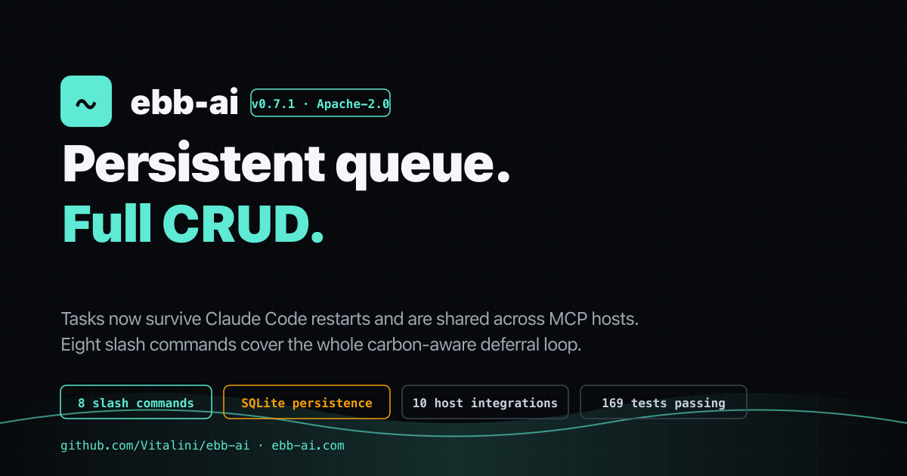

# ebb-ai v0.7.1 release package



This folder is the **ready-to-share artefact** for v0.7.1. Drop links
to it on Show HN, in the npm release notes, in a press kit, or anywhere
else the project gets cited.

## Contents

| File / dir | Purpose |
|---|---|
| [`release-notes.md`](./release-notes.md) | Human-readable summary of what changed in v0.7.1 (paste-ready for Show HN comments, X thread, mailing-list announcement) |
| [`diagrams/`](./diagrams/) | Architecture + grid-routing diagrams (Mermaid sources + rendered PNGs) |
| [`pdf/`](./pdf/) | PDF renders of the public docs (README, PLUGIN.md, CHANGELOG.md, release-notes.md) |
| [`images/`](./images/) | 1200×630 hero card (`hero.png`) + 512×512 brand mark (`mark.png`). SVG sources live in `images/src/`. |

## Source of truth

Code: https://github.com/Vitalini/ebb-ai
Tag: [`v0.7.1`](https://github.com/Vitalini/ebb-ai/releases/tag/v0.7.1)
Live demo: https://ebb-ai.com
npm:
- [`@ebb-ai/core@0.7.0`](https://www.npmjs.com/package/@ebb-ai/core)
- [`@ebb-ai/mcp@0.7.1`](https://www.npmjs.com/package/@ebb-ai/mcp) *(updated)*
- [`@ebb-ai/cli@0.7.0`](https://www.npmjs.com/package/@ebb-ai/cli)

## Install

```bash
claude plugin marketplace add Vitalini/ebb-ai
claude plugin install ebb-ai
```

In any Claude Code session afterwards:

```
/ebb-ai:plan summarize today's notifications --by 4h
/ebb-ai:defer summarize today's notifications --by 4h
/ebb-ai:check
```
